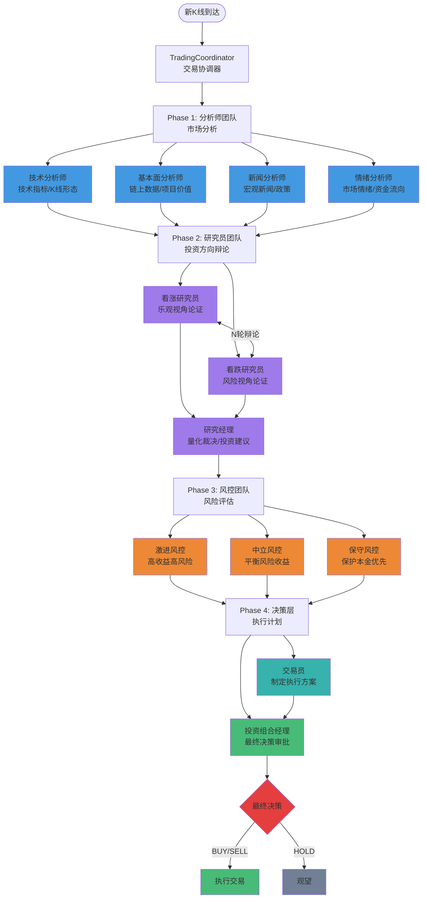
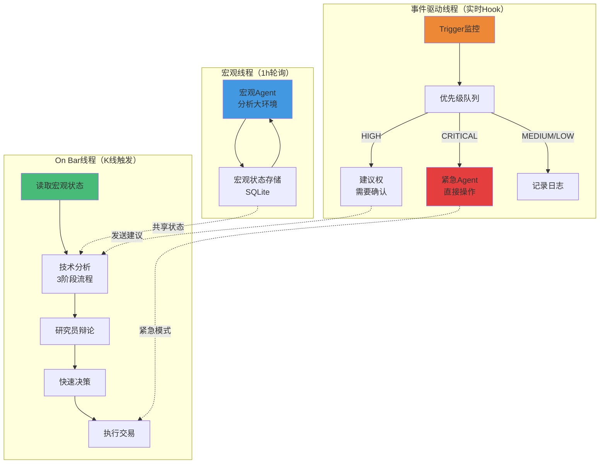

# Vibe Trading

基于大语言模型的多 Agent 协作加密货币量化交易系统。

## ✨ 特性

**🚀 最新改进 (2026-04-03)**:

- **多线程架构**: 3线程并行处理，提升响应速度和系统稳定性
  - 宏观线程: 每小时轮询分析大环境（趋势、情绪、重大事件）
  - On Bar线程: K线触发的简化决策流程（3阶段）
  - 事件驱动线程: 实时监控Trigger，秒级紧急响应
  - 分级紧急权限: CRITICAL直接操作，HIGH建议权，MEDIUM/LOW记录日志
  - 优先级队列: 按严重程度处理并发事件（CRITICAL > HIGH > MEDIUM > LOW）
- **Trigger机制**: 可扩展的事件触发系统
  - 价格Trigger: 暴跌、暴涨、突破关键位、插针
  - 风控Trigger: VaR超标、连续亏损、保证金不足
  - 类似工具注册的扩展方式，用户可自定义Trigger
- **Agent Tools集成**: 23个工具封装，按角色分配专门工具集
  - 技术分析工具 (9个): 指标、趋势、支撑阻力、K线形态、背离、成交量、枢轴点
  - 基本面工具 (5个): 资金费率、多空比、持仓量、买卖比例、大户多空比
  - 情绪分析工具 (3个): 恐惧贪婪指数、新闻情绪、社交情绪
  - 风险数据工具 (4个): 清算订单、持仓量等
  - 模型路由器: 自动切换iflow模型进行工具调用
- **状态机管理**: 决策流程状态追踪，7种状态转换管理
- **Agent消息标准化**: 8种消息类型，correlation_id关联追踪
- **并行执行优化**: Phase 1并行执行，~30x加速比
- **结构化日志**: JSON/控制台双格式，性能计时
- **API限流管理**: 令牌桶算法，2400/分钟保护
- **决策树可视化**: Web UI实时决策树展示
- **缓存机制**: 混合LRU+文件缓存，~2700x加速
- **Token优化**: Prompt压缩91%+，成本控制

详见 [Agent Tools集成文档](./docs/AGENT_TOOLS_INTEGRATION.md) | [改进实施总结](./IMPROVEMENTS_SUMMARY.md)

**🔬 与 TradeAgents 对比**:

Vibe Trading 项目从 TradeAgents 汲取灵感，并在以下方面进行了优化和创新：

| 特性 | Vibe Trading | TradeAgents |
| :--- | :--- | :--- |
| **Agent 协作** | 4阶段12 Agent 层级协作 | 多 Agent 协作 |
| **决策机制** | 研究员多轮辩论 + 投资组合经理裁决 | Agent 投票/共识 |
| **记忆系统** | BM25 语义搜索 + 反思机制 | 记忆存储 |
| **数据源** | Binance 深度集成 + 多数据源回退 | 单数据源 |
| **LLM 路由** | 双模型架构 (深度/快速思考) | 单一模型 |
| **信号处理** | 结构化信号提取 (BUY/SELL/HOLD) | 文本决策 |
| **质量追踪** | 决策质量评估 + Agent 排名 | 基础日志 |
| **状态管理** | 状态机 + 消息代理 + 决策树 | 基础状态 |
| **并发控制** | LLM 并发限制 + 并行执行 | 串行执行 |

**P0 & P1 核心改进 (2026-04-07)**:

1. **反思机制** (`memory/reflection.py`): 从交易结果中学习，自动更新 Agent 记忆
2. **信号处理器** (`coordinator/signal_processor.py`): 从 Agent 文本提取结构化交易信号
3. **状态传播增强** (`coordinator/state_propagator.py`): 管理 Agent 间状态传播
4. **双模型配置** (`pi_ai/llm.yaml`): 深度/快速思考模型明确分离
5. **数据源回退** (`data_sources/vendor_router.py`): 多数据源自动切换
6. **决策质量评估** (`coordinator/quality_tracker.py`): 跟踪和评估决策质量

详见 [P0 & P1 改进文档](./backend/docs/IMPROVEMENTS_P0_P1.md)

**核心功能**:

**核心功能**:
- **🤖 12 Agent 协作决策**: 4阶段层级协作，从市场分析到交易执行
- **🎭 智能辩论系统**: 看涨/看跌研究员多轮辩论，论点自动提取和量化裁决
- **🧠 BM25 记忆系统**: 从历史交易经验中学习，持续优化
- **📊 Binance 深度集成**: 支持永续合约交易，实时 K线订阅
- **🎯 Paper Trading**: 模拟交易模式，零风险验证策略
- **🌐 Web 实时监控**: 可视化界面实时展示决策过程和决策树
- **🔄 流式输出**: 实时查看 Agent 思考过程
- **🔬 高级技术分析**: K线形态检测、指标背离、成交量分析、支撑阻力位
- **⚡ 智能风控**: VaR计算、凯利公式、波动率调整、相关性风险检查
- **📈 多维度分析**: 技术/基本面/情绪/宏观/风险五维度综合评估

## 🏗️ 系统架构

系统采用4阶段协作架构，每个阶段有明确的职责边界：



## 🧵 多线程架构

系统采用3线程并行处理架构，提升响应速度和系统稳定性：



### 3个独立线程

#### 1. 宏观判断线程

- **运行周期**: 每小时轮询一次
- **职责**: 分析大环境（趋势、情绪、重大事件）
- **存储**: SQLite数据库（macro_states表）
- **输出**: 
  - 趋势方向（UPTREND/DOWNTREND/SIDEWAYS）
  - 市场情绪（POSITIVE/NEGATIVE/NEUTRAL）
  - 重大事件列表
  - Agent建议

**特点**: 长期视角，不受短期波动干扰

#### 2. On Bar线程（主流程）

- **触发方式**: K线到达时触发
- **流程**: 简化的3阶段决策流程
  1. 读取宏观状态
  2. 技术分析（只运行技术分析师）
  3. 研究员辩论（综合宏观+技术）
  4. 快速决策（包含风控检查）
- **优化**: 利用预计算的宏观状态，提升决策效率

**简化流程**: 
- 原流程: 5阶段（ANALYZING → DEBATING → ASSESSING_RISK → PLANNING → COMPLETED）
- 简化后: 3阶段（TECHNICAL_ANALYSIS → DEBATE → DECISION）

#### 3. 事件驱动线程

- **运行方式**: 实时监控Trigger
- **响应时间**: 秒级紧急响应
- **处理流程**:
  1. 检查Trigger是否触发
  2. 按优先级排队（CRITICAL > HIGH > MEDIUM > LOW）
  3. 分级处理：
     - **CRITICAL**: 直接操作，无需审批
     - **HIGH**: 建议权，需要确认
     - **MEDIUM/LOW**: 记录日志，不执行操作
  4. 紧急事件时，主线程自动屏蔽

### Trigger机制

**设计理念**: 类似工具注册的可扩展机制

```python
# 注册自定义Trigger
class CustomTrigger(BaseTrigger):
    name = "custom_trigger"
    priority = TriggerPriority.HIGH
    
    async def check(self, context: TriggerContext) -> Optional[TriggerEvent]:
        # 自定义逻辑
        if condition:
            return TriggerEvent(
                trigger_name=self.name,
                severity=TriggerSeverity.HIGH,
                data={...}
            )
        return None

# 注册
trigger_registry.register(CustomTrigger())
```

**内置Trigger**:

| 类型 | Trigger | 阈值 | 严重程度 |
| ---- | ------- | ---- | -------- |
| **价格** | PriceDropTrigger | 3%暴跌 | HIGH |
| **价格** | PriceSpikeTrigger | 3%暴涨 | MEDIUM |
| **价格** | BreakoutTrigger | 突破关键位 | MEDIUM |
| **价格** | WickReversalTrigger | 插针反转 | LOW |
| **价格** | TrendReversalTrigger | 趋势反转 | HIGH |
| **风控** | MarginRatioTrigger | 保证金 > 80% | CRITICAL |
| **风控** | DrawdownTrigger | 回撤 > 20% | CRITICAL |
| **风控** | ConsecutiveLossTrigger | 连续亏损 ≥ 5 | HIGH |
| **风控** | VaRTrigger | VaR 99% > 5% | HIGH |
| **风控** | LiquidationTrigger | 清算预警 | CRITICAL |
| **风控** | VolatilityTrigger | 波动率异常 | MEDIUM |

### 线程间通信

**通信机制**: 混合模式（MessageBroker + 共享状态 + 优先级队列）

- **MessageBroker**: Agent间消息传递
- **SharedStateManager**: 线程安全的共享状态存储
- **PriorityQueue**: 事件按优先级处理
- **Event Notification**: 状态变更通知

**紧急模式协调**:
1. 事件驱动线程触发紧急事件
2. 通知主线程进入紧急模式
3. 主线程停止正常操作
4. 紧急Agent快速决策并执行
5. 通知主线程恢复

### 数据库表设计

**macro_states表**:
```sql
CREATE TABLE macro_states (
    id INTEGER PRIMARY KEY,
    symbol VARCHAR(20),
    timestamp BIGINT,
    trend_direction VARCHAR(20),  -- UPTREND/DOWNTREND/SIDEWAYS
    trend_strength VARCHAR(20),   -- STRONG/MODERATE/WEAK
    market_regime VARCHAR(20),    -- BULL/BEAR/NEUTRAL
    overall_sentiment VARCHAR(20),
    sentiment_score REAL,
    major_events TEXT,
    agent_recommendation TEXT,
    confidence REAL
);
```

**trigger_configs表**:
```sql
CREATE TABLE trigger_configs (
    id INTEGER PRIMARY KEY,
    trigger_name VARCHAR(50),
    trigger_type VARCHAR(20),
    config_json TEXT,
    enabled BOOLEAN,
    priority INTEGER,
    cooldown_seconds INTEGER
);
```

**trigger_events表**:
```sql
CREATE TABLE trigger_events (
    id INTEGER PRIMARY KEY,
    event_id VARCHAR(50),
    trigger_name VARCHAR(50),
    severity VARCHAR(20),
    data_json TEXT,
    status VARCHAR(20),  -- PENDING/CONFIRMED/EXECUTED/IGNORED
    action_taken TEXT,
    detected_at BIGINT
);
```

## 🤖 12 Agent 详细分析

### Phase 1: 分析师团队 (4个) - 市场分析

**阶段目标**: 全面分析市场状况，提供多维度数据支持

| Agent | 职责范围 | 核心工具 | 输出 |
| ----- | -------- | -------- | ---- |
| **技术分析师** | 技术面分析，识别趋势和信号 | • `get_technical_indicators()` - RSI/MACD/布林带<br>• `analyze_trend()` - 趋势分析<br>• `detect_candlestick_patterns()` - K线形态<br>• `detect_divergence()` - 指标背离<br>• `analyze_volume_patterns()` - 成交量<br>• `detect_support_resistance()` - 支撑阻力 | 技术面分析报告<br>趋势判断<br>入场信号提示 |
| **基本面分析师** | 基本面分析，评估项目价值 | • `get_on_chain_metrics()` - 链上指标<br>• `analyze_whale_activity()` - 大户活动<br>• `get_gas_metrics()` - Gas费分析<br>• `analyze_funding_rates()` - 资金费率<br>• `get_long_short_ratio()` - 多空比例 | 基本面分析报告<br>项目健康度评估<br>价值判断 |
| **新闻分析师** | 宏观新闻分析，识别催化剂 | • 市场新闻扫描<br>• 监管政策解读<br>• 机构动向跟踪<br>• 宏观经济数据分析 | 新闻面分析报告<br>潜在催化剂识别<br>风险评估 |
| **情绪分析师** | 市场情绪分析，识别极端情绪 | • `get_fear_and_greed_index()` - 恐惧贪婪指数<br>• `get_social_sentiment()` - 社交情绪<br>• `analyze_news_sentiment()` - 新闻情绪<br>• `get_market_breadth()` - 市场广度<br>• `analyze_open_interest()` - 持仓量 | 情绪面分析报告<br>极端情绪预警<br>市场热度评估 |

**阶段协作方式**: 4个分析师并行工作，各自专注不同维度，互不干扰，完成后同时进入下一阶段。

---

### Phase 2: 研究员团队 (3个) - 投资方向辩论

**阶段目标**: 基于分析师报告，通过辩论确定投资方向（BUY/SELL/HOLD）

| Agent | 职责范围 | 核心工具 | 输出 |
| ----- | -------- | -------- | ---- |
| **看涨研究员** | 从看涨角度论证投资机会 | • 分析师报告解读<br>• 看涨论点构建<br>• 反驳看跌观点 | 看涨发言稿<br>看涨论点列表 |
| **看跌研究员** | 从看跌角度分析风险 | • 分析师报告解读<br>• 看跌论点构建<br>• 反驳看涨观点 | 看跌发言稿<br>看跌论点列表 |
| **研究经理** | 裁决多空辩论，制定投资计划 | • **论点提取器** - 自动提取8类论点<br>• **辩论评估器** - 多维度量化评分<br>• **建议引擎** - 生成投资建议 | 投资建议（BUY/SELL/HOLD）<br>置信度<br>紧急程度 |

**智能辩论分析系统**:
- **论点自动提取**: 从发言中提取8类论点（技术面30%、基本面25%、情绪面20%、宏观15%、资金流10%）
- **论点强度评估**: 极强/强/中等/弱/极弱，置信度0-1
- **多维度评分**: 技术面/基本面/情绪面/宏观/风险5个维度
- **量化裁决**: 综合论点强度、证据支持、共识度
- **共识度计算**: 计算多空双方在各维度的共识程度

**阶段协作方式**: 看涨和看跌研究员进行N轮辩论（默认2轮），互相反驳。研究经理使用辩论分析器量化评估，给出最终投资建议。

---

### Phase 3: 风控团队 (3个) - 风险评估

**阶段目标**: 评估交易风险，给出风险参数建议

| Agent | 风险参数建议 | 核心工具 | 特点 |
| ----- | ------------ | -------- | ---- |
| **激进风控** | 仓位20-30%，止损3-5%，杠杆5-10x | • VaR计算器 - 95%/99%置信度<br>• 凯利计算器 - 最优仓位<br>• 风险指标计算器 | 追求高收益<br>承担更大风险 |
| **中立风控** | 仓位10-15%，止损2-3%，杠杆3-5x | • 波动率调整仓位<br>• 相关性风险检查<br>• 移动止损管理 | 风险收益平衡 |
| **保守风控** | 仓位5-10%，止损1-2%，杠杆2-3x | • VaR计算器 - 严格风控<br>• 风险等级评估<br>• 预警系统 | 保护本金优先 |

**高级风控工具**:
- **VaR (风险价值) 计算**: 95%/99%置信度下的最大可能亏损
- **凯利公式仓位优化**: 基于历史数据计算最优仓位（半凯利）
- **综合风险指标**: 最大回撤、夏普比率、索提诺比率
- **波动率调整**: 高波动减仓，低波动加仓
- **相关性检查**: 多币种风险分散
- **移动止损**: 盈利后保护利润

**阶段协作方式**: 3个风控Agent基于投资建议，各自从不同风险偏好出发评估风险，给出不同的风险参数建议。

---

### Phase 4: 决策层 (2个) - 执行计划与最终决策

**阶段目标**: 基于前面3阶段的输出，制定执行方案并做出最终决策

| Agent | 职责范围 | 核心工具 | 输出 |
| ----- | -------- | -------- | ---- |
| **交易员** | 制定具体执行方案（如何进场） | • **执行策略计算器** - 确定执行风格<br>• **仓位计算器** - 计算仓位大小<br>• **止损止盈计算器** - ATR-based止损止盈 | 交易执行计划<br>入场订单<br>止损/止盈订单 |
| **投资组合经理** | 最终决策审批 | • **决策框架** - 多维度评分<br>• **历史记忆** - BM25检索<br>• **决策评分卡** | 最终决策<br>执行指令 |

**决策层职责边界**:
- **不判断"是否进场"** - 这由前面3阶段已经确定
- **专注"如何进场"** - 订单类型、入场方式、仓位、止损止盈

**执行策略计算器**:
- **立即执行**: 高紧急度，市价单
- **激进限价**: 价差较大，略优于市价
- **耐心限价**: 低紧急度，等待更好价格
- **分批建仓**: 低紧急度+高波动，降低成本
- **等待回调**: 低紧急度，等待回调入场

**阶段协作方式**:
1. 交易员接收已确定的投资方向（BUY/SELL/HOLD）
2. 整合3个风控Agent的建议，确定风险偏好
3. 使用执行策略计算器确定入场方式
4. 计算仓位、止损、止盈
5. 投资组合经理审批交易计划，做出最终决策

---

## 🔄 阶段间协作流程

### 数据流转

```
Phase 1 (分析师)
    ↓
    [技术面报告, 基本面报告, 新闻面报告, 情绪面报告]
    ↓
Phase 2 (研究员)
    ↓
    [投资建议: BUY/SELL/HOLD, 置信度, 紧急程度]
    ↓
Phase 3 (风控)
    ↓
    [激进/中立/保守风控建议]
    ↓
Phase 4 (决策层)
    ↓
    [最终决策 + 执行计划]
    ↓
执行交易 或 观望
```

### 职责边界

| 问题 | 负责阶段 | 说明 |
| ---- | -------- | ---- |
| 市场状况如何？ | Phase 1 | 分析师团队全面分析 |
| 是否应该交易？ | Phase 2 | 研究员团队通过辩论确定方向 |
| 有多大风险？ | Phase 3 | 风控团队评估风险等级 |
| 如何执行交易？ | Phase 4 | 决策层制定执行方案 |
| 是否最终执行？ | Phase 4 | 投资组合经理最终审批 |

### 关键决策点

1. **Phase 1 → Phase 2**: 分析师报告是否支持明确的交易方向？
2. **Phase 2 → Phase 3**: 研究经理的投资建议是否为BUY/SELL？
3. **Phase 3 → Phase 4**: 风控评估是否在可接受范围内？
4. **Phase 4 最终**: 投资组合经理是否批准执行？

## 🔧 Agent 工具系统

### 工具总览

系统共有 **23 个工具**，按 Agent 角色专门分配：

### 技术分析工具 (9个)

| 工具名称 | 功能描述 | 返回内容 |
| -------- | -------- | -------- |
| `get_technical_indicators()` | 获取综合技术指标 | RSI, MACD, 布林带, SMA/EMA, ATR |
| `get_comprehensive_technical_analysis()` | 综合技术分析 | 趋势、信号、支撑阻力位 |
| `analyze_trend()` | 趋势方向和强度分析 | 趋势方向, 趋势强度, 价格与均线关系 |
| `detect_support_resistance()` | 支撑阻力位检测 | 支撑位列表, 阻力位列表, 强度评级 |
| `detect_candlestick_patterns()` | K线形态检测 | Doji, Hammer, Engulfing, Morning/Evening Star等 |
| `detect_divergence()` | 指标背离检测 | RSI背离, MACD背离, 背离强度 |
| `analyze_volume_patterns()` | 成交量分析 | 放量/缩量, OBV趋势, 量价关系 |
| `calculate_pivots()` | 枢轴点计算 | 经典枢轴, 斐波那契枢轴, 关键位 |
| `get_kline_data()` | 获取K线数据 | OHLCV数据 |

### 基本面/合约工具 (5个)

| 工具名称 | 功能描述 | 返回内容 |
| -------- | -------- | -------- |
| `get_funding_rate()` | 资金费率 | 当前费率, 标记价格 |
| `get_long_short_ratio()` | 多空比例 | 多空比, 多空账户占比 |
| `get_open_interest()` | 持仓量 | 持仓量, 变化幅度 |
| `get_taker_buy_sell_ratio()` | 主动买卖比例 | 主动买盘/卖盘比例 |
| `get_top_trader_long_short_ratio()` | 大户多空比 | Top Trader多空比 |

### 情绪分析工具 (3个)

| 工具名称 | 功能描述 | 返回内容 |
| -------- | -------- | -------- |
| `get_fear_and_greed_index()` | 恐惧贪婪指数 | 当前数值, 分类 |
| `get_news_sentiment()` | 新闻情绪分析 | 最新新闻, 情绪评分 |
| `get_social_sentiment()` | 社交媒体情绪 | 情绪评分, 提及次数 |
| `get_comprehensive_sentiment()` | 综合情绪分析 | 综合评分, 信号 |

### 市场数据工具 (3个)

| 工具名称 | 功能描述 | 返回内容 |
| -------- | -------- | -------- |
| `get_current_price()` | 当前价格 | 最新成交价 |
| `get_24hr_ticker()` | 24小时行情 | 涨跌幅, 成交量 |
| `get_order_book()` | 订单簿深度 | 买卖盘深度 |

### 风险数据工具 (3个)

| 工具名称 | 功能描述 | 返回内容 |
| -------- | -------- | -------- |
| `get_liquidation_orders()` | 清算订单 | 最近清算记录 |
| `get_trending_symbols()` | 热门交易对 | 涨跌幅榜 |

### 工具分配

| Agent | 工具数 | 包含工具 |
| ----- | ------ | -------- |
| Technical Analyst | 8 | 价格、行情、订单簿、技术指标、趋势、支撑阻力、K线形态 |
| Fundamental Analyst | 5 | 资金费率、多空比、持仓量、买卖比例、大户多空比 |
| News Analyst | 2 | 新闻情绪、热门交易对 |
| Sentiment Analyst | 5 | 恐惧贪婪、社交情绪、综合情绪、资金费率、多空比 |
| Bull/Bear Researcher | 8 | 价格、行情、恐惧贪婪、新闻、资金费率、多空比、持仓量、技术指标 |
| Research Manager | 8 | (同研究员) |
| Debators (3种) | 4 | 清算订单、资金费率、持仓量、买卖比例 |
| Trader | 5 | 价格、行情、订单簿、资金费率、技术指标 |
| Portfolio Manager | 23 | 全部工具 |

详细说明见 [Agent Tools集成文档](./docs/AGENT_TOOLS_INTEGRATION.md)

## 🔧 高级风控工具

| 工具名称 | 功能描述 | 应用场景 |
| -------- | -------- | -------- |
| `calculate_var()` | VaR风险价值计算 | 单笔交易风险评估 |
| `calculate_kelly_fraction()` | 凯利公式仓位计算 | 基于历史数据优化仓位 |
| `get_risk_metrics()` | 综合风险指标 | 实时监控账户风险水平 |
| `calculate_volatility_adjusted_position()` | 波动率调整仓位 | 动态仓位管理 |
| `check_portfolio_correlation()` | 相关性风险检查 | 多币种风险分散 |
| `manage_trailing_stop()` | 移动止损管理 | 保护盈利，动态止盈 |

## 📦 安装

```bash
# 克隆仓库
git clone https://github.com/your-username/vibe-trading.git
cd vibe-trading

# 安装依赖
cd backend
uv pip install -e .

# 配置环境变量
cp .env.example .env
# 编辑 .env 填入你的 API 密钥
```

## ⚙️ 配置

创建 `.env` 文件：

```bash
# =============================================================================
# 交易设置
# =============================================================================
# 交易模式: paper (模拟交易) or live (实盘交易)
TRADING_MODE=paper

# 交易品种 (逗号分隔)
SYMBOLS=BTCUSDT,ETHUSDT

# K线周期: 1m, 3m, 5m, 15m, 30m, 1h, 2h, 4h, 6h, 8h, 12h, 1d, 3d, 1w, 1M
INTERVAL=30m

# 风险管理
MAX_POSITION_SIZE=0.1          # 单笔最大仓位 (USDT)
MAX_TOTAL_POSITION=0.3         # 总最大仓位
STOP_LOSS_PCT=0.02             # 止损百分比 (2%)
TAKE_PROFIT_PCT=0.05           # 止盈百分比 (5%)
LEVERAGE=5                     # 最大杠杆 (1-125)

# Agent 设置
DEBATE_ROUNDS=2                # 研究员辩论轮数
ENABLE_MEMORY=true             # 启用 BM25 记忆系统
MEMORY_TOP_K=3                 # 记忆检索数量

# =============================================================================
# Binance API 配置
# =============================================================================
# Testnet (模拟交易) - 从 https://testnet.binancefuture.com/ 获取
BINANCE_TESTNET_API_KEY=your_testnet_key
BINANCE_TESTNET_API_SECRET=your_testnet_secret

# Mainnet (实盘交易) - 从 https://www.binance.com/en/my/settings/api-management 获取
BINANCE_API_KEY=your_api_key
BINANCE_API_SECRET=your_api_secret

# =============================================================================
# LLM 配置
# =============================================================================
# 模型名称 (在 backend/src/pi_ai/llm.yaml 中配置)
LLM_MODEL=glm_4_7

# 可选模型:
# - glm_4_7: 智谱 GLM-4.7 (推荐，速度快)
# - iflow: qwen3-235b (质量高但慢)
# - longcat: LongCat 深度思考模型
# - big_pickle: OpenCode Zen 免费模型
# - gemini3_flash: 快速免费模型

# =============================================================================
# 数据库
# =============================================================================
DATABASE_URL=sqlite+aiosqlite:///./vibe_trading.db

# =============================================================================
# 日志
# =============================================================================
LOG_LEVEL=INFO
LOG_FILE=./vibe_trading.log
```

## 🚀 系统改进

### 已完成改进 (2026-04-03)

| 改进项 | 状态 | 文件 | 效果 |
| :--- | :--- | :--- | :--- |
| 状态机管理 | ✅ | `coordinator/state_machine.py` | 决策流程状态追踪 |
| Agent消息标准化 | ✅ | `agents/messaging.py` | 结构化Agent通信 |
| 并行执行优化 | ✅ | `coordinator/parallel_executor.py` | ~30x加速比 |
| 结构化日志 | ✅ | `config/logging_config.py` | JSON/控制台双格式 |
| API限流管理 | ✅ | `data_sources/rate_limiter.py` | 令牌桶算法保护 |
| 决策树可视化 | ✅ | `web/server.py` + `frontend/index.html` | Web UI实时决策树 |
| 缓存机制 | ✅ | `data_sources/cache.py` | 混合缓存~2700x加速 |
| Token优化 | ✅ | `agents/token_optimizer.py` | Prompt压缩91%+ |

详细说明见 [改进实施总结](./IMPROVEMENTS_SUMMARY.md)

---

## 🚀 使用

### 历史数据回测

```bash
# 运行历史数据回测（带 Web 监控界面）
uv run test_historical.py

# Web 界面: http://localhost:8000
```

### 单元测试

```bash
# 测试技术分析
uv run test_technical_analysis.py

# 测试情绪分析
uv run test_sentiment_tools.py

# 测试研究员团队辩论
uv run test_researcher_debate.py

# 测试决策层
uv run test_decision_layer.py
```

### 命令行工具

#### 单线程模式（原版）

```bash
# 启动交易机器人
cd backend/src
python -m vibe_trading.main start --symbol BTCUSDT --interval 30m

# 单次分析
python -m vibe_trading.main analyze --symbol BTCUSDT --interval 30m

# 查看配置
python -m vibe_trading.main config --show
```

#### 多线程模式（推荐）

```bash
# 启动多线程交易系统
cd backend
PYTHONPATH=src uv run -- vibe-trade start BTCUSDT

# 实盘模式（仅打印）
PYTHONPATH=src uv run -- vibe-trade start BTCUSDT --mode live

# 实盘模式（实际执行）
PYTHONPATH=src uv run -- vibe-trade start BTCUSDT --mode live --execute

# 运行单次分析
PYTHONPATH=src uv run -- vibe-trade analyze --symbol BTCUSDT

# 管理内存系统
PYTHONPATH=src uv run -- vibe-trade memory --help

# 查看配置
PYTHONPATH=src uv run -- vibe-trade config --show
```

**多线程模式优势**:
- ✅ 宏观分析独立运行，不受K线影响
- ✅ 紧急事件秒级响应
- ✅ 主流程简化，决策速度更快
- ✅ 系统稳定性更高

## 📁 项目结构

```
vibe-trading/
├── backend/
│   └── src/
│       ├── pi_agent_core/       # Agent 核心框架
│       ├── pi_ai/               # LLM 配置管理
│       ├── pi_logger/           # 日志系统
│       └── vibe_trading/
│           ├── config/          # 配置管理
│           │   ├── settings.py       # 全局配置
│           │   ├── agent_config.py   # Agent 配置
│           │   ├── prompts.py        # System Prompt
│           │   └── binance_config.py # Binance 配置
│           ├── data_sources/    # 数据源
│           │   ├── binance_client.py     # Binance API 客户端
│           │   ├── kline_storage.py      # K线数据存储
│           │   └── technical_indicators.py # 技术指标计算
│           ├── tools/           # Agent 工具
│           │   ├── market_data_tools.py   # 市场数据工具
│           │   ├── technical_tools.py     # 技术分析工具
│           │   ├── fundamental_tools.py   # 基本面工具
│           │   └── sentiment_tools.py     # 情绪分析工具
│           ├── agents/          # Agent 实现
│           │   ├── analysts/            # 分析师团队
│           │   ├── researchers/         # 研究员团队
│           │   │   ├── debate_analyzer.py    # 辩论分析器
│           │   │   └── researcher_agents.py
│           │   ├── risk_mgmt/           # 风控团队
│           │   ├── decision/            # 决策层
│           │   │   ├── trading_tools.py      # 交易执行工具
│           │   │   └── decision_agents.py
│           │   └── agent_factory.py     # Agent 工厂
│           ├── execution/       # 订单执行
│           │   ├── advanced_risk_tools.py  # 高级风控工具
│           │   ├── order_executor.py
│           │   ├── position_manager.py
│           │   └── risk_manager.py
│           ├── coordinator/     # 交易协调器
│           │   ├── trading_coordinator.py    # 原版协调器
│           │   ├── simplified_coordinator.py  # 简化协调器（多线程）
│           │   ├── thread_manager.py         # 线程管理器
│           │   ├── shared_state.py           # 共享状态管理
│           │   ├── event_queue.py            # 事件优先级队列
│           │   ├── emergency_handler.py      # 紧急事件处理器
│           │   └── state_machine.py          # 状态机管理
│           ├── triggers/        # Trigger系统
│           │   ├── base_trigger.py           # Trigger基类
│           │   ├── trigger_registry.py       # Trigger注册中心
│           │   ├── price_triggers.py         # 价格相关Trigger
│           │   ├── risk_triggers.py          # 风控相关Trigger
│           │   └── trigger_storage.py        # Trigger存储
│           ├── threads/         # 线程实现
│           │   ├── macro_thread.py           # 宏观分析线程
│           │   └── onbar_thread.py           # On Bar主线程
│           ├── agents/          # Agent 实现
│           │   ├── macro_agent.py            # 宏观分析Agent
│           │   ├── risk_mgmt/
│           │   │   └── emergency_agent.py     # 紧急风控Agent
│           │   ├── decision/
│           │   │   └── emergency_agent.py     # 紧急决策Agent
│           │   ├── analysts/            # 分析师团队
│           │   ├── researchers/         # 研究员团队
│           │   │   ├── debate_analyzer.py    # 辩论分析器
│           │   │   └── researcher_agents.py
│           │   ├── risk_mgmt/           # 风控团队
│           │   ├── decision/            # 决策层
│           │   │   ├── trading_tools.py      # 交易执行工具
│           │   │   └── decision_agents.py
│           │   └── agent_factory.py     # Agent 工厂
│           ├── execution/       # 订单执行
│           │   ├── advanced_risk_tools.py  # 高级风控工具
│           │   ├── order_executor.py
│           │   ├── position_manager.py
│           │   └── risk_manager.py
│           ├── memory/          # BM25 记忆系统
│           ├── data_sources/    # 数据源
│           │   ├── binance_client.py     # Binance API 客户端
│           │   ├── kline_storage.py      # K线数据存储
│           │   ├── macro_storage.py      # 宏观状态存储
│           │   ├── technical_indicators.py # 技术指标计算
│           │   └── migrations/           # 数据库迁移
│           │       └── 001_create_macro_tables.sql
│           ├── web/             # Web 监控界面
│           │   └── server.py
│           ├── main/            # 多线程主入口
│           │   └── multi_thread_main.py
│           └── main.py          # 主入口
├── frontend/
│   └── index.html              # Web 监控界面
├── test_researcher_debate.py   # 研究员团队测试
├── test_decision_layer.py      # 决策层测试
├── test_historical.py          # 历史数据回测脚本
├── pyproject.toml              # Python 项目配置
├── README.md                   # 项目文档
├── TODO.md                     # API 集成计划
└── .env                        # 环境变量配置
```

## 🎯 风险管理

### 基础风险参数

| 参数         | 默认值 | 说明                   |
| ------------ | ------ | ---------------------- |
| 单笔最大仓位 | 10%    | 账户余额的 10%         |
| 总最大仓位   | 30%    | 所有仓位总和不超过 30% |
| 止损百分比   | 2%     | 亏损 2% 自动止损       |
| 止盈百分比   | 5%     | 盈利 5% 自动止盈       |
| 最大杠杆     | 5x     | 可配置 1-125 倍        |

### 高级风险指标

| 指标 | 说明 | 预警阈值 |
| ---- | ---- | -------- |
| **VaR (95%)** | 95%置信度下的最大可能亏损 | > 账户余额 3% |
| **VaR (99%)** | 99%置信度下的最大可能亏损 | > 账户余额 5% |
| **最大回撤** | 历史最大回撤幅度 | > 20% (危险) |
| **当前回撤** | 当前账户回撤幅度 | > 15% (高风险) |
| **夏普比率** | 风险调整后收益 | < 0.5 (需优化) |
| **索提诺比率** | 下行风险调整后收益 | < 0.5 (需优化) |
| **保证金使用率** | 已用保证金占比 | > 80% (危险) |
| **连续亏损** | 连续亏损次数 | ≥ 5 (建议暂停) |

### 风险等级系统

- **🟢 Low (低风险)**: 所有指标在安全范围内
- **🟡 Medium (中等风险)**: 回撤 > 10% 或保证金 > 40%
- **🟠 High (高风险)**: 回撤 > 15% 或保证金 > 60% 或连续亏损 ≥ 3
- **🔴 Critical (危险)**: 回撤 > 20% 或保证金 > 80% 或连续亏损 ≥ 5

### 多线程风险管理

**Trigger风险监控**:
- 价格暴跌/暴涨触发
- 保证金不足自动平仓
- 连续亏损自动暂停
- VaR超标预警

**紧急模式权限**:
- **CRITICAL**: 直接操作，无需审批（如自动平仓）
- **HIGH**: 建议权，需要确认（如风险提示）
- **MEDIUM/LOW**: 记录日志，不执行操作（如市场预警）

**紧急事件处理流程**:
1. Trigger触发 → 事件队列 → 按优先级处理
2. CRITICAL事件 → 通知主线程暂停 → 紧急Agent决策 → 直接执行
3. HIGH事件 → 通知主线程 → 发送建议 → 主线程决定是否执行
4. MEDIUM/LOW事件 → 记录日志 → 等待人工查看

## 🌐 Web 监控界面

运行 `test_historical.py` 后，访问 http://localhost:8000 可查看：

- **K线价格走势**: 蜡烛图 + 决策标记点
- **Agent 协作流程**: 4个阶段实时状态
- **Agent 报告**: 分 Tab 查看各 Agent 分析报告
- **决策历史**: 每次决策的记录和统计
- **实时日志**: 系统运行日志流式输出

## 📚 灵感来源

本项目受到 [TradingAgents](https://github.com/TauricResearch/TradingAgents) 项目的启发，将其多 Agent 辩论框架适配到加密货币永续合约交易场景。

## 📊 多线程架构性能指标

### 功能完整性
- ✅ 宏观判断线程能够每小时独立运行并更新状态
- ✅ On Bar线程能够读取宏观状态并执行3阶段简化流程
- ✅ 事件驱动线程能够监控Trigger并处理紧急事件
- ✅ 紧急模式能够正确屏蔽主线程并执行紧急操作
- ✅ 线程间通信机制能够正常工作
- ✅ 优先级队列能够正确处理并发Trigger事件
- ✅ 分级权限能够正确执行（CRITICAL直接操作，HIGH建议权）

### 性能指标
- ✅ 宏观分析线程单次运行时间 < 30秒
- ✅ 简化主流程单次决策时间 < 60秒
- ✅ 紧急事件响应时间 < 10秒
- ✅ Trigger检查延迟 < 1秒
- ✅ 系统整体CPU使用率 < 80%

### 可靠性指标
- ✅ 线程崩溃率 < 1次/天
- ✅ 数据库查询成功率 > 99.9%
- ✅ 消息传递成功率 > 99.9%
- ✅ 紧急模式激活成功率 > 99%

### 可扩展性指标
- ✅ 新增Trigger无需修改核心代码
- ✅ 支持同时运行10+个Trigger
- ✅ 支持同时监控3+个交易对
- ✅ 支持动态启用/禁用Trigger

## 🚀 未来规划

### API 集成计划

| API 平台 | 用途 | 优先级 | 状态 |
| -------- | ---- | ------ | ---- |
| **Whale Alert** | 大额转账监控 | 🔴 高 | 待集成 |
| **CryptoQuant** | 专业链上数据 | 🔴 高 | 待集成 |
| **FRED API** | 宏观经济数据 | 🟡 中 | 待集成 |
| **Etherscan** | Gas费数据 | 🟡 中 | 待集成 |
| **Coinglass** | 跨交易所数据 | 🟡 中 | 待集成 |
| **GitHub API** | 项目开发活跃度 | 🟢 低 | 待集成 |

详细规划请查看 [TODO.md](TODO.md)（API集成）和 [IMPROVEMENTS.md](IMPROVEMENTS.md)（系统改进）

## ⚠️ 免责声明

本项目仅供学习和研究使用。加密货币交易存在高风险，可能导致本金损失。使用本系统进行实盘交易的所有风险由用户自行承担。
