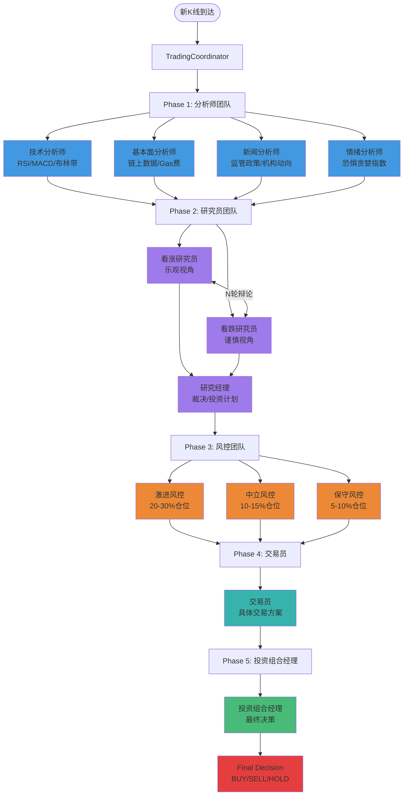

# Vibe Trading

基于大语言模型的多 Agent 协作加密货币量化交易系统。

## ✨ 特性

- **🤖 12 Agent 协作决策**: 分析师、研究员、风控、交易员、投资组合经理多层级协作
- **🎭 动态辩论机制**: 看涨/看跌研究员多轮辩论，达成最优决策
- **🧠 BM25 记忆系统**: 从历史交易经验中学习，持续优化
- **📊 Binance 深度集成**: 支持永续合约交易，实时 K线订阅
- **🎯 Paper Trading**: 模拟交易模式，零风险验证策略
- **🌐 Web 实时监控**: 可视化界面实时展示决策过程
- **🔄 流式输出**: 实时查看 Agent 思考过程

## 🏗️ 系统架构



## 🤖 12 Agent 介绍

### Phase 1: 分析师团队 (4个)

| Agent                  | 职责                              | 工具                                           |
| ---------------------- | --------------------------------- | ---------------------------------------------- |
| **技术分析师**   | K线和技术指标分析，识别趋势和信号 | RSI, MACD, 布林带, SMA/EMA, ATR                |
| **基本面分析师** | 链上数据分析，项目价值评估        | 链上活跃地址, 大额转账, Gas费, 项目进度        |
| **新闻分析师**   | 宏观新闻分析，识别催化剂          | 监管政策, 交易所动态, 机构动向, 美联储政策     |
| **情绪分析师**   | 市场情绪分析，识别极端情绪        | 恐惧贪婪指数, 资金费率, 多空比例, 社交媒体热度 |

### Phase 2: 研究员团队 (3个)

| Agent                | 职责                       | 特点                       |
| -------------------- | -------------------------- | -------------------------- |
| **看涨研究员** | 从看涨角度论证投资机会     | 乐观视角，寻找被低估机会   |
| **看跌研究员** | 从看跌角度分析风险         | 谨慎视角，识别被高估风险   |
| **研究经理**   | 裁决多空辩论，制定投资计划 | 综合双方观点，给出最终建议 |

### Phase 3: 风控团队 (3个)

| Agent              | 风控参数建议                    | 特点                     |
| ------------------ | ------------------------------- | ------------------------ |
| **激进风控** | 仓位20-30%，止损3-5%，杠杆5-10x | 追求高收益，承担更大风险 |
| **中立风控** | 仓位10-15%，止损2-3%，杠杆3-5x  | 风险收益平衡             |
| **保守风控** | 仓位5-10%，止损1-2%，杠杆2-3x   | 保护本金优先             |

### Phase 4: 决策层 (2个)

| Agent                  | 职责                                           |
| ---------------------- | ---------------------------------------------- |
| **交易员**       | 制定具体交易方案（入场、止损、止盈、加仓计划） |
| **投资组合经理** | **最终决策者**，综合所有意见给出交易指令 |

## 📦 安装

```bash
# 克隆仓库
git clone https://github.com/your-username/vibe-trading.git
cd vibe-trading

# 安装依赖
cd backend
uv pip install -e .

# 配置环境变量
cp .env.example .env
# 编辑 .env 填入你的 API 密钥
```

## ⚙️ 配置

创建 `.env` 文件：

```bash
# =============================================================================
# 交易设置
# =============================================================================
# 交易模式: paper (模拟交易) or live (实盘交易)
TRADING_MODE=paper

# 交易品种 (逗号分隔)
SYMBOLS=BTCUSDT,ETHUSDT

# K线周期: 1m, 3m, 5m, 15m, 30m, 1h, 2h, 4h, 6h, 8h, 12h, 1d, 3d, 1w, 1M
INTERVAL=30m

# 风险管理
MAX_POSITION_SIZE=0.1          # 单笔最大仓位 (USDT)
MAX_TOTAL_POSITION=0.3         # 总最大仓位
STOP_LOSS_PCT=0.02             # 止损百分比 (2%)
TAKE_PROFIT_PCT=0.05           # 止盈百分比 (5%)
LEVERAGE=5                     # 最大杠杆 (1-125)

# Agent 设置
DEBATE_ROUNDS=2                # 研究员辩论轮数
ENABLE_MEMORY=true             # 启用 BM25 记忆系统
MEMORY_TOP_K=3                 # 记忆检索数量

# =============================================================================
# Binance API 配置
# =============================================================================
# Testnet (模拟交易) - 从 https://testnet.binancefuture.com/ 获取
BINANCE_TESTNET_API_KEY=your_testnet_key
BINANCE_TESTNET_API_SECRET=your_testnet_secret

# Mainnet (实盘交易) - 从 https://www.binance.com/en/my/settings/api-management 获取
BINANCE_API_KEY=your_api_key
BINANCE_API_SECRET=your_api_secret

# =============================================================================
# LLM 配置
# =============================================================================
# 模型名称 (在 backend/src/pi_ai/llm.yaml 中配置)
LLM_MODEL=glm_4_7

# 可选模型:
# - glm_4_7: 智谱 GLM-4.7 (推荐，速度快)
# - iflow: qwen3-235b (质量高但慢)
# - longcat: LongCat 深度思考模型
# - big_pickle: OpenCode Zen 免费模型
# - gemini3_flash: 快速免费模型

# =============================================================================
# 数据库
# =============================================================================
DATABASE_URL=sqlite+aiosqlite:///./vibe_trading.db

# =============================================================================
# 日志
# =============================================================================
LOG_LEVEL=INFO
LOG_FILE=./vibe_trading.log
```

## 🚀 使用

### 历史数据回测

```bash
# 运行历史数据回测（带 Web 监控界面）
uv run test_historical.py

# Web 界面: http://localhost:8000
```

### 命令行工具

```bash
# 启动交易机器人
cd backend/src
python -m vibe_trading.main start --symbol BTCUSDT --interval 30m

# 单次分析
python -m vibe_trading.main analyze --symbol BTCUSDT --interval 30m

# 查看配置
python -m vibe_trading.main config --show
```

## 📁 项目结构

```
vibe-trading/
├── backend/
│   └── src/
│       ├── pi_agent_core/       # Agent 核心框架
│       ├── pi_ai/               # LLM 配置管理
│       ├── pi_logger/           # 日志系统
│       └── vibe_trading/
│           ├── config/          # 配置管理
│           │   ├── settings.py       # 全局配置
│           │   ├── agent_config.py   # Agent 配置
│           │   ├── prompts.py        # System Prompt
│           │   └── binance_config.py # Binance 配置
│           ├── data_sources/    # 数据源
│           │   ├── binance_client.py     # Binance API 客户端
│           │   ├── kline_storage.py      # K线数据存储
│           │   └── technical_indicators.py # 技术指标计算
│           ├── tools/           # Agent 工具
│           │   ├── market_data_tools.py   # 市场数据工具
│           │   ├── technical_tools.py     # 技术分析工具
│           │   ├── fundamental_tools.py   # 基本面工具
│           │   └── sentiment_tools.py     # 情绪分析工具
│           ├── agents/          # Agent 实现
│           │   ├── analysts/            # 分析师团队
│           │   │   ├── technical_analyst.py
│           │   │   ├── fundamental_analyst.py
│           │   │   ├── news_analyst.py
│           │   │   └── sentiment_analyst.py
│           │   ├── researchers/         # 研究员团队
│           │   │   └── researcher_agents.py
│           │   ├── risk_mgmt/           # 风控团队
│           │   │   └── risk_agents.py
│           │   ├── decision/            # 决策层
│           │   │   └── decision_agents.py
│           │   └── agent_factory.py     # Agent 工厂
│           ├── coordinator/     # 交易协调器
│           │   └── trading_coordinator.py
│           ├── execution/       # 订单执行
│           │   ├── order_executor.py
│           │   ├── position_manager.py
│           │   └── risk_manager.py
│           ├── memory/          # BM25 记忆系统
│           ├── web/             # Web 监控界面
│           │   └── server.py
│           └── main.py          # 主入口
├── frontend/
│   └── index.html              # Web 监控界面
├── test_historical.py          # 历史数据回测脚本
├── pyproject.toml              # Python 项目配置
└── .env                        # 环境变量配置
```

## 🎯 风险管理

默认风险参数：

| 参数         | 默认值 | 说明                   |
| ------------ | ------ | ---------------------- |
| 单笔最大仓位 | 10%    | 账户余额的 10%         |
| 总最大仓位   | 30%    | 所有仓位总和不超过 30% |
| 止损百分比   | 2%     | 亏损 2% 自动止损       |
| 止盈百分比   | 5%     | 盈利 5% 自动止盈       |
| 最大杠杆     | 5x     | 可配置 1-125 倍        |

## 🌐 Web 监控界面

运行 `test_historical.py` 后，访问 http://localhost:8000 可查看：

- **K线价格走势**: 蜡烛图 + 决策标记点
- **Agent 协作流程**: 5个阶段实时状态
- **Agent 报告**: 分 Tab 查看各 Agent 分析报告
- **决策历史**: 每次决策的记录和统计
- **实时日志**: 系统运行日志流式输出

## 📚 灵感来源

本项目受到 [TradingAgents](https://github.com/Significant-Gravitas/AutoGPT) 项目的启发，将其多 Agent 辩论框架适配到加密货币永续合约交易场景。
