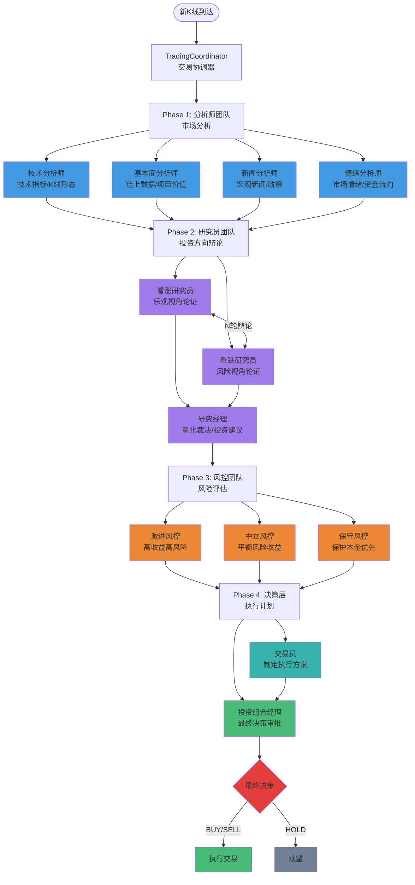

# 系统架构详解

## 整体架构

Vibe Trading 采用 4 阶段层级协作架构，将复杂的交易决策分解为多个专业 Agent 协作完成。

### 架构图



## 组件详解

### 1. TradingCoordinator (交易协调器)

**文件**: `coordinator/trading_coordinator.py`

**职责**:
- 协调 4 个阶段的执行
- 管理 Agent 间的消息传递
- 收集和分析结果
- 触发决策执行

**关键方法**:
```python
async def analyze_and_decide(
    current_price: float,
    account_balance: float
) -> Decision
```

---

### 2. Agent 消息系统

**文件**: `agents/messaging.py`

**消息类型** (8种):
- `TECHNICAL_ANALYSIS`: 技术分析结果
- `FUNDAMENTAL_ANALYSIS`: 基本面分析结果
- `NEWS_ANALYSIS`: 新闻分析结果
- `SENTIMENT_ANALYSIS`: 情绪分析结果
- `BULL_ARGUMENT`: 看涨论点
- `BEAR_ARGUMENT`: 看跌论点
- `RISK_ASSESSMENT`: 风险评估
- `TRADING_PLAN`: 交易计划
- `PORTFOLIO_DECISION`: 投资组合决策

**消息结构**:
```python
@dataclass
class AgentMessage:
    message_id: str
    correlation_id: str  # 关联消息ID
    sender: str
    receiver: str
    message_type: MessageType
    content: Dict
    timestamp: datetime
    metadata: Dict
```

---

### 3. 状态机管理

**文件**: `coordinator/state_machine.py`

**状态类型** (7种):
- `IDLE`: 空闲
- `ANALYZING`: 分析中
- `DEBATING`: 辩论中
- `ASSESSING_RISK`: 风险评估中
- `PLANNING`: 制定计划中
- `DECIDING`: 决策中
- `COMPLETED`: 完成

**状态转换**:
```
IDLE → ANALYZING → DEBATING → ASSESSING_RISK → PLANNING → DECIDING → COMPLETED → IDLE
```

---

### 4. 共享状态管理

**文件**: `coordinator/shared_state.py`

**功能**:
- 线程安全的状态存储
- 支持 TTL 自动过期
- 支持订阅通知
- 异步 API

**示例**:
```python
# 设置状态（带过期时间）
await shared_state.set("macro_trend", "UPTREND", ttl_seconds=3600)

# 获取状态
trend = await shared_state.get("macro_trend")

# 订阅状态变化
def on_state_change(key, value):
    print(f"State changed: {key} = {value}")

shared_state.subscribe("macro_trend", on_state_change)
```

---

### 5. 事件队列

**文件**: `coordinator/event_queue.py`

**优先级** (4级):
- `CRITICAL`: 最高优先级，自动执行
- `HIGH`: 高优先级，需要确认
- `MEDIUM`: 中等优先级，记录日志
- `LOW`: 低优先级，记录日志

**使用示例**:
```python
from vibe_trading.coordinator.event_queue import get_event_queue

event_queue = get_event_queue()

# 创建事件
event = TriggerEvent(
    trigger_type="price_drop",
    severity=TriggerSeverity.CRITICAL,
    data={"symbol": "BTCUSDT", "drop_pct": -0.08}
)

# 发送到队列
await event_queue.put(event)
```

---

### 6. Agent 框架

**基础**: `pi_agent_core`

**核心功能**:
- 状态管理
- 事件系统
- Prompt/Steer/Follow-up 机制
- 流式输出
- 记忆管理

**Agent 创建**:
```python
from vibe_trading.agents.agent_factory import create_trading_agent

agent = await create_trading_agent(
    config=AgentConfig(
        name="Technical Analyst",
        role="technical_analyst",
        temperature=0.5
    ),
    tool_context=tool_context,
    enable_streaming=True
)
```

---

### 7. LLM 路由器

**文件**: `pi_ai/model_router.py`

**双模型架构**:
- `deep_thinking_model`: 复杂推理、工具调用
- `quick_thinking_model`: 数据获取、简单分析

**路由规则**:
1. Agent 角色映射（最高优先级）
2. 有工具调用 → deep_thinking_model
3. 无工具调用 → quick_thinking_model

**配置** (`pi_ai/llm.yaml`):
```yaml
model_router:
  deep_thinking_model: iflow      # 复杂推理
  quick_thinking_model: glm_4_7    # 快速思考
  
  agent_model_mapping:
    technical_analyst: quick_thinking_model
    portfolio_manager: deep_thinking_model
```

---

### 8. 工具系统

**文件**: `tools/market_data_tools.py`, `tools/technical_tools.py` 等

**工具分类**:
- 技术分析工具 (9个)
- 基本面工具 (5个)
- 情绪分析工具 (3个)
- 风险数据工具 (4个)
- 市场数据工具 (2个)

**工具定义**:
```python
@tool
async def get_technical_indicators(
    symbol: str,
    interval: str,
    storage: KlineStorage
) -> Dict:
    """获取技术指标"""
    # 实现逻辑
```

---

### 9. 数据源层

**文件**: `data_sources/`

**组件**:
- `BinanceClient`: WebSocket 和 REST API 客户端
- `KlineStorage`: K线数据存储 (SQLite)
- `MacroStorage`: 宏观状态存储
- `RateLimiter`: 令牌桶限流器

**数据流**:
```
Binance WebSocket → KlineStorage → Agent Tools → Agent 分析
                      ↓
                   SQLite
```

---

### 10. 线程管理

**文件**: `coordinator/thread_manager.py`

**线程类型**:
- 宏观线程 (MacroAnalysisThread)
- On Bar 线程 (OnBarThread)
- 事件线程 (EventThread)

**生命周期**:
```python
await thread.initialize()
await thread.start()
await thread.stop()
```

---

## 数据流

### 典型决策流程

```
1. 新K线到达
   ↓
2. TradingCoordinator.analyze_and_decide()
   ↓
3. Phase 1: 分析师并行执行
   ├─ TechnicalAnalystAgent.analyze()
   ├─ FundamentalAnalystAgent.analyze()
   ├─ NewsAnalystAgent.analyze()
   └─ SentimentAnalystAgent.analyze()
   ↓
4. Phase 2: 研究员辩论
   ├─ BullResearcherAgent.respond()
   ├─ BearResearcherAgent.respond()
   └─ ResearchManagerAgent.make_recommendation()
   ↓
5. Phase 3: 风控评估
   ├─ AggressiveRiskAnalystAgent.assess_risk()
   ├─ NeutralRiskAnalystAgent.assess_risk()
   └─ ConservativeRiskAnalystAgent.assess_risk()
   ↓
6. Phase 4: 决策
   ├─ TraderAgent.create_trading_plan()
   └─ PortfolioManagerAgent.make_final_decision()
   ↓
7. 执行决策
```

### 并行优化

Phase 1 的 4 个分析师并行执行，使用 `asyncio.gather()`:

```python
results = await asyncio.gather(
    technical_analyst.analyze(market_data),
    fundamental_analyst.analyze(market_data),
    news_analyst.analyze(market_data),
    sentiment_analyst.analyze(market_data)
)
```

这带来了约 30x 的加速比。

---

## 扩展性

### 添加新 Agent

1. 在 `config/agent_config.py` 中定义 AgentRole
2. 创建 Agent 类，继承合适的基类
3. 在 `agent_factory.py` 中注册
4. 在 TradingCoordinator 中集成

### 添加新工具

1. 在 `tools/` 中定义工具函数
2. 使用 `@tool` 装饰器
3. 在 Agent 配置中指定工具列表

### 添加新 Trigger

1. 继承 `BaseTrigger`
2. 实现 `check()` 方法
3. 在 `trigger_registry` 中注册
