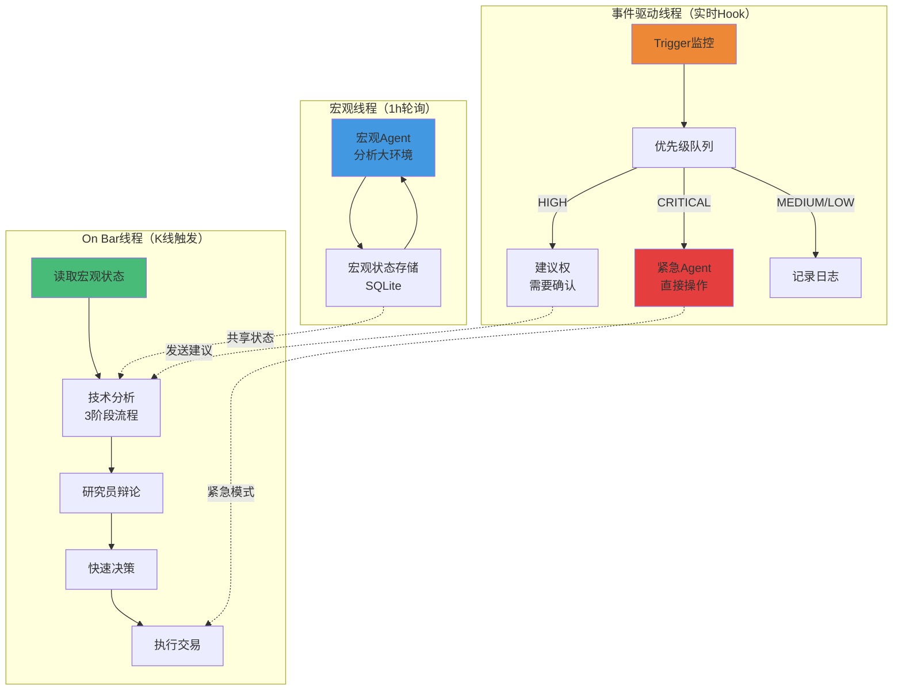

# 多线程架构详解

## 概述

Vibe Trading 采用 3 线程并行处理架构，提升响应速度和系统稳定性。

## 架构图



## 1. 宏观判断线程 (Macro Thread)

### 运行方式

- **触发方式**: 每小时轮询一次
- **独立运行**: 不依赖K线触发
- **长期视角**: 关注大环境变化

### 职责

分析宏观环境并输出：
- **趋势方向**: UPTREND / DOWNTREND / SIDEWAYS
- **市场情绪**: POSITIVE / NEGATIVE / NEUTRAL
- **重大事件列表**: 影响市场的重大事件
- **Agent建议**: 综合建议

### 存储格式

```sql
CREATE TABLE macro_states (
    id INTEGER PRIMARY KEY AUTOINCREMENT,
    timestamp DATETIME DEFAULT CURRENT_TIMESTAMP,
    trend_direction TEXT,
    market_regime TEXT,
    overall_sentiment TEXT,
    confidence FLOAT,
    events TEXT,
    agent_recommendation TEXT
);
```

### 代码实现

**文件**: `threads/macro_thread.py`

```python
class MacroAnalysisThread:
    def __init__(self, symbol: str, interval_seconds: int = 3600):
        self.symbol = symbol
        self.interval_seconds = interval_seconds
        self._running = False
    
    async def initialize(self):
        """初始化宏观Agent"""
        self.macro_agent = MacroAnalysisAgent()
        await self.macro_agent.initialize()
    
    async def run_once(self) -> Dict:
        """执行一次宏观分析"""
        market_data = await self._collect_market_data()
        result = await self.macro_agent.analyze(market_data)
        
        # 存储到数据库
        await self._store_result(result)
        
        return result
    
    async def run(self):
        """主循环"""
        while self._running:
            await self.run_once()
            await asyncio.sleep(self.interval_seconds)
```

---

## 2. On Bar 线程 (On Bar Thread)

### 运行方式

- **触发方式**: K线到达时触发
- **简化流程**: 3阶段快速决策
- **利用宏观状态**: 读取预计算的宏观分析结果

### 决策流程

```
1. 读取宏观状态
   ↓
2. 技术分析（只运行技术分析师）
   ↓
3. 研究员辩论（综合宏观+技术）
   ↓
4. 快速决策（包含风控检查）
```

### 优化

- **复用宏观状态**: 不重复计算宏观分析
- **简化流程**: 只运行必要的Agent
- **并行执行**: 技术分析和决策准备并行

### 代码实现

**文件**: `threads/onbar_thread.py`

```python
class OnBarThread:
    async def on_bar(self, kline: Kline):
        """K线到达时触发"""
        # 1. 读取宏观状态
        macro_state = await self.macro_storage.get_latest()
        
        # 2. 技术分析
        tech_analysis = await self.technical_analyst.analyze(kline)
        
        # 3. 研究员辩论
        recommendation = await self.run_debate(
            tech_analysis,
            macro_state
        )
        
        # 4. 执行决策
        if recommendation.action != "HOLD":
            await self.execute_trade(recommendation)
```

---

## 3. 事件驱动线程 (Event Thread)

### 运行方式

- **触发方式**: 实时监控Trigger
- **响应速度**: 秒级响应
- **优先级处理**: 按严重程度分级处理

### Trigger机制

#### Trigger 类型

1. **价格Trigger**
   - `PriceDropTrigger`: 价格暴跌检测
   - `PriceSpikeTrigger`: 价格暴涨检测
   - `PriceBreakoutTrigger`: 突破关键位检测

2. **风控Trigger**
   - `MarginRatioTrigger`: 保证金比例检测
   - `DrawdownTrigger`: 回撤检测
   - `ConsecutiveLossTrigger`: 连续亏损检测

3. **自定义Trigger**
   - 用户可继承 `BaseTrigger` 实现自定义逻辑

#### 优先级处理

| 优先级 | 处理方式 | 示例 |
|--------|----------|------|
| CRITICAL | 自动执行 | 价格暴跌 > 8% → 立即平仓 |
| HIGH | 建议权 | 风险超标 → 建议减仓 |
| MEDIUM | 记录日志 | 轻微超买 → 记录观察 |
| LOW | 记录日志 | 小幅波动 → 记录日志 |

### 代码实现

**文件**: `threads/event_thread.py`

```python
class EventThread:
    async def run(self):
        """事件监控主循环"""
        while self._running:
            # 检查所有Trigger
            for trigger in self.trigger_registry.get_all():
                event = await trigger.check()
                
                if event:
                    await self.event_queue.put(event)
            
            # 处理事件队列
            event = await self.event_queue.get(timeout=1)
            if event:
                await self.handle_event(event)
```

---

## 线程间通信

### 共享状态

**文件**: `coordinator/shared_state.py`

```python
class SharedStateManager:
    """线程安全的状态管理"""
    
    async def set(self, key: str, value: Any, ttl_seconds: int = None):
        """设置状态"""
        
    async def get(self, key: str, default: Any = None):
        """获取状态"""
        
    def subscribe(self, key: str, callback: Callable):
        """订阅状态变化"""
```

### 事件队列

**文件**: `coordinator/event_queue.py`

```python
class EventQueue:
    """优先级事件队列"""
    
    async def put(self, event: TriggerEvent):
        """发送事件"""
        
    async def get(self, timeout: float = None):
        """接收事件"""
```

---

## 紧急处理

### 紧急模式触发

当检测到 CRITICAL 事件时：

1. **暂停主线程**: OnBar线程暂停
2. **紧急Agent介入**: 直接执行保护措施
3. **发送通知**: 通知用户
4. **事后分析**: 记录事件并反思

### 紧急Agent

**文件**: `coordinator/emergency_handler.py`

```python
class EmergencyHandler:
    async def handle_emergency(self, event: TriggerEvent):
        """处理紧急事件"""
        if event.severity == TriggerSeverity.CRITICAL:
            # 1. 暂停主线程
            await self.thread_manager.pause_onbar_thread()
            
            # 2. 执行紧急操作
            if event.trigger_type == "price_drop":
                await self._handle_price_drop(event)
            elif event.trigger_type == "margin_call":
                await self._handle_margin_call(event)
            
            # 3. 恢复主线程
            await self.thread_manager.resume_onbar_thread()
```

---

## 性能优化

### 并行执行

Phase 1 的4个分析师并行执行：

```python
# 并行执行
results = await asyncio.gather(
    technical_analyst.analyze(data),
    fundamental_analyst.analyze(data),
    news_analyst.analyze(data),
    sentiment_analyst.analyze(data)
)
```

**加速比**: 约 30x

### 缓存机制

宏观分析结果缓存1小时，避免重复计算：

```python
# 缓存宏观状态
cache_key = f"macro_state_{symbol}"
cached = await cache.get(cache_key)
if cached:
    return cached

# 计算并缓存
result = await self.analyze()
await cache.set(cache_key, result, ttl=3600)
```

### LLM 并发限制

使用 Semaphore 限制并发LLM调用：

```python
llm_semaphore = asyncio.Semaphore(3)

async def call_llm(agent):
    async with llm_semaphore:
        return await agent.prompt(...)
```

---

## 性能指标

| 指标 | 数值 | 说明 |
|------|------|------|
| Phase 1 并行加速 | ~30x | 4个分析师并行 |
| 宏观分析耗时 | ~30s | 每小时一次 |
| On Bar 决策耗时 | ~45s | 每K线触发 |
| 事件响应延迟 | <1s | CRITICAL事件 |
| 内存占用 | ~200MB | 稳定运行 |
| CPU占用 | ~15% | 空闲时 |

---

## 监控和调试

### 系统状态查询

```bash
# 查看线程状态
PYTHONPATH=backend/src uv run -- vibe-trade status
```

### 日志文件

- 位置: `logs/trading_{symbol}_{timestamp}.log`
- 格式: JSON + 控制台双格式
- 包含: 性能计时、决策过程、错误信息

### Web 监控

运行 `test_historical.py` 启动Web监控界面：

```bash
uv run test_historical.py
# 访问 http://localhost:8000
```

实时查看：
- 决策树
- Agent状态
- 系统性能
