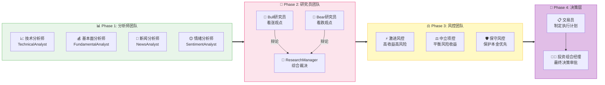

# Agent 团队

Vibe Trading 系统包含12个专业Agent，每个Agent都有特定的职责和专长，共同协作完成复杂的交易决策。

## Agent 概览



## Phase 1: 分析师团队

### TechnicalAnalystAgent（技术分析师）

**职责**：从技术分析角度评估市场趋势和交易机会

**工具箱**（9个工具）：
- `get_technical_indicators` - 获取技术指标（RSI、MACD、布林带等）
- `detect_trend` - 检测趋势方向
- `detect_divergence` - 检测指标背离
- `find_support_resistance` - 查找支撑阻力位
- `detect_chart_pattern` - 检测K线形态
- `analyze_volume` - 成交量分析
- `calculate_pivot_points` - 计算枢轴点
- `get_atr` - 获取ATR波动率
- `get_bollinger_bands` - 获取布林带

**输出**：技术分析报告
```json
{
  "trend_direction": "upward",
  "key_signals": ["RSI超买", "突破阻力位"],
  "support_levels": [65000, 63000],
  "resistance_levels": [68000, 70000],
  "strength": 0.75
}
```

---

### FundamentalAnalystAgent（基本面分析师）

**职责**：从基本面角度评估市场健康状况和资金流向

**工具箱**（5个工具）：
- `get_funding_rate` - 获取资金费率
- `get_long_short_ratio` - 获取多空比
- `get_open_interest` - 获取持仓量
- `get_taker_buy_sell_volume` - 获取买卖比例
- `get_whale_long_short_ratio` - 获取大户多空比

**输出**：基本面分析报告
```json
{
  "funding_rate": 0.01,
  "long_short_ratio": 1.2,
  "sentiment": "bullish",
  "money_flow": "inflow",
  "strength": 0.65
}
```

---

### NewsAnalystAgent（新闻分析师）

**职责**：跟踪和分析可能影响市场的重大新闻和事件

**关注领域**：
- 货币政策变化
- 监管公告
- 重大交易所动态
- 宏观经济事件
- 地缘政治风险

**输出**：新闻分析报告
```json
{
  "major_events": ["美联储议息会议", "ETF通过"],
  "impact_level": "high",
  "expected_direction": "bullish",
  "confidence": 0.8
}
```

---

### SentimentAnalystAgent（情绪分析师）

**职责**：从市场情绪角度评估投资者心理状态

**工具箱**（3个工具）：
- `get_fear_greed_index` - 恐惧贪婪指数
- `get_news_sentiment` - 新闻情绪
- `get_social_sentiment` - 社交媒体情绪

**输出**：情绪分析报告
```json
{
  "fear_greed_index": 72,
  "sentiment": "greedy",
  "news_sentiment": "positive",
  "social_sentiment": "bullish",
  "strength": 0.7
}
```

## Phase 2: 研究员团队

### BullResearcherAgent（看涨研究员）

**职责**：从乐观视角论证投资机会，挖掘市场积极因素

**工作方式**：
- 与看跌研究员进行多轮辩论
- 提取看涨论点并量化
- 使用 ArgumentExtractor 工具
- 寻找技术支撑和基本面利好

**典型论点**：
- "技术面显示上升趋势，突破关键阻力位"
- "基本面数据显示资金持续流入"
- "情绪指标显示市场信心增强"

**输出**：看涨论点列表
```json
{
  "arguments": [
    {"point": "技术突破", "strength": 0.8},
    {"point": "资金流入", "strength": 0.7}
  ],
  "overall_confidence": 0.75
}
```

---

### BearResearcherAgent（看跌研究员）

**职责**：从风险视角论证潜在风险，识别市场威胁

**工作方式**：
- 与看涨研究员进行多轮辩论
- 指出潜在风险点
- 使用 ArgumentExtractor 工具
- 寻找技术警示和基本面风险

**典型论点**：
- "RSI接近超买，存在回调风险"
- "持仓量异常增加，警惕庄家出货"
- "宏观环境不确定性增加"

**输出**：看跌论点列表
```json
{
  "arguments": [
    {"point": "技术超买", "strength": 0.6},
    {"point": "宏观风险", "strength": 0.5}
  ],
  "overall_confidence": 0.55
}
```

---

### ResearchManagerAgent（研究经理）

**职责**：综合研究员辩论，做出投资建议

**工作方式**：
- 分析双方论点
- 使用 DebateEvaluator 评估辩论质量
- 使用 RecommendationEngine 生成投资建议
- 输出 InvestmentRecommendation

**决策框架**：
- 综合评分系统
- 权重分配：
  - 技术分析权重：30%
  - 基本面权重：25%
  - 情绪指标权重：20%
  - 风险评估权重：25%

**输出**：投资建议
```json
{
  "direction": "LONG",
  "confidence": 0.75,
  "rationale": "技术面和基本面支持上涨，但需注意回调风险",
  "key_factors": ["技术突破", "资金流入", "情绪积极"]
}
```

## Phase 3: 风控团队

### AggressiveRiskAnalystAgent（激进风控分析师）

**职责**：高收益高风险视角的风险评估

**关注点**：
- 最大收益潜力
- 可接受的最大风险
- 激进的仓位建议

**典型建议**：
```json
{
  "position_size": "30%",
  "stop_loss": "3%",
  "take_profit": "10%",
  "risk_reward_ratio": 3.33,
  "confidence": 0.8
}
```

---

### NeutralRiskAnalystAgent（中立风控分析师）

**职责**：平衡风险收益视角的风险评估

**关注点**：
- 风险收益平衡
- 适中的仓位建议
- 波动率调整

**典型建议**：
```json
{
  "position_size": "20%",
  "stop_loss": "2%",
  "take_profit": "8%",
  "risk_reward_ratio": 4.0,
  "confidence": 0.75
}
```

---

### ConservativeRiskAnalystAgent（保守风控分析师）

**职责**：保护本金优先视角的风险评估

**关注点**：
- 本金安全
- 严格的止损
- 小仓位试探

**典型建议**：
```json
{
  "position_size": "10%",
  "stop_loss": "1.5%",
  "take_profit": "5%",
  "risk_reward_ratio": 3.33,
  "confidence": 0.7
}
```

## Phase 4: 决策层

### TraderAgent（交易员）

**职责**：制定详细的交易执行计划

**输入**：
- 投资方向（LONG/SHORT）
- 投资建议
- 风险评估报告
- 当前价格
- 账户余额

**工具**：
- `PositionSizeCalculator` - 计算仓位大小
- `StopLossTakeProfitCalculator` - 计算止损止盈
- `ExecutionStrategyCalculator` - 计算执行策略

**输出**：交易执行计划
```json
{
  "direction": "LONG",
  "position_size": 0.2,
  "entry_price": 65000,
  "stop_loss": 63500,
  "take_profit": 68500,
  "execution_strategy": "limit_order"
}
```

---

### PortfolioManagerAgent（投资组合经理）

**职责**：最终决策审批，综合考虑所有因素

**决策框架**：
- 综合评分系统
- 决策因子权重：
  - 技术信号权重：25%
  - 基本面权重：20%
  - 情绪指标权重：15%
  - 风险合规性：25%
  - 历史表现：15%

**输出**：最终决策
```json
{
  "decision": "BUY",
  "quantity": 0.2,
  "rationale": "综合评估后，建议买入，置信度75%",
  "confidence": 0.75
}
```

## Agent 协作示例

```
新K线到达
  ↓
Phase 1: 分析师并行执行
  ├─ 技术分析师: "上升趋势，RSI=65，突破阻力位"
  ├─ 基本面分析师: "资金费率正，多头占优"
  ├─ 新闻分析师: "无重大利空"
  └─ 情绪分析师: "贪婪指数72，市场情绪积极"
  ↓
Phase 2: 研究员辩论
  ├─ 看涨研究员: "技术面和基本面都支持上涨"
  ├─ 看跌研究员: "但RSI接近超买，需警惕回调"
  └─ 研究经理: "综合评估，建议LONG，置信度75%"
  ↓
Phase 3: 风控评估
  ├─ 激进风控: "建议30%仓位，止损3%"
  ├─ 中立风控: "建议20%仓位，止损2%"
  └─ 保守风控: "建议10%仓位，止损1.5%"
  ↓
Phase 4: 决策
  ├─ 交易员: "制定计划，LONG 20%，65000入场，63500止损"
  └─ 投资组合经理: "批准执行，BUY 0.2 BTC"
```

## Agent 配置

所有Agent的配置在 `backend/src/vibe_trading/config/agent_config.py`:

```python
class AgentConfig:
    name: str
    role: AgentRole
    temperature: float  # 控制创造性
    enabled: bool = True
```

可以通过修改配置文件调整每个Agent的行为。

## 下一步

- 了解 [协作流程](/guide/workflow) 的详细实现
- 配置 [Web监控](/guide/monitoring) 查看Agent实时状态
- 学习 [自定义Agent](/guide/custom-agent) 添加新的Agent