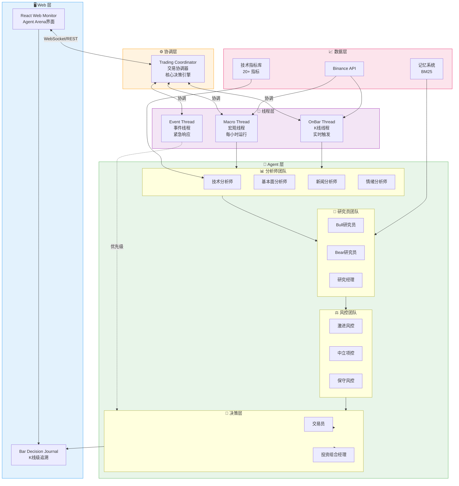
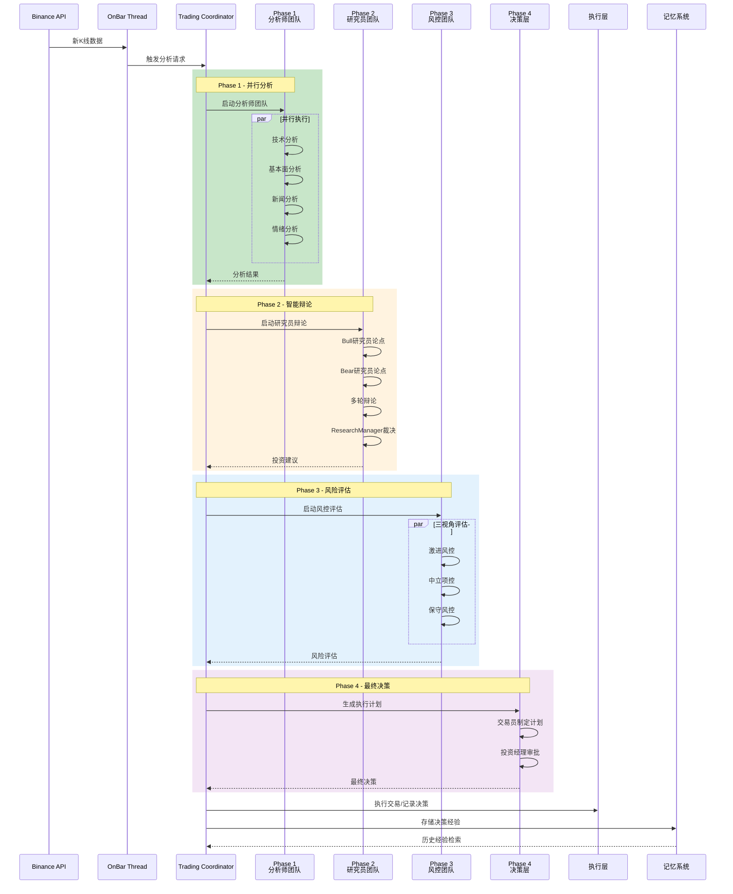

# 系统架构

本文档详细介绍 Vibe Trading 的系统架构、技术选型和实现细节。

## 整体架构

Vibe Trading 采用模块化、异步的三层架构：



## 核心组件

### 1. Trading Coordinator（交易协调器）

交易协调器是系统的核心决策引擎，负责协调所有Agent的协作流程。

**主要职责：**
- 管理Agent生命周期
- 协调4阶段决策流程
- 整合Agent输出
- 生成最终决策

**关键方法：**
```python
class TradingCoordinator:
    async def analyze_and_decide(current_price, account_balance)
    async def run_analyst_phase()
    async def run_research_phase()
    async def run_risk_phase()
    async def run_decision_phase()
```

### 2. Multi-Thread Architecture（多线程架构）

系统采用三线程架构，并行处理不同类型的任务。

#### Macro Thread（宏观线程）
- **执行频率**：每小时一次
- **主要任务**：
  - 分析市场趋势
  - 评估整体情绪
  - 识别重大事件
  - 更新市场环境状态

#### On Bar Thread（K线线程）
- **触发条件**：新K线到达
- **主要任务**：
  - 执行完整决策流程
  - 生成交易决策
  - 更新交易状态

#### Event Thread（事件线程）
- **触发条件**：紧急事件发生
- **主要任务**：
  - 监控价格异常波动
  - 检测风险超标
  - 触发应急响应
  - 通知交易协调器

### 3. Agent Ecosystem（Agent生态系统）

系统包含12个专业Agent，分为4个团队。

#### Analyst Team（分析师团队）

**TechnicalAnalystAgent（技术分析师）**
- 使用9个技术分析工具
- 识别趋势方向
- 检测支撑阻力位
- 分析成交量

**FundamentalAnalystAgent（基本面分析师）**
- 分析资金费率
- 评估多空比例
- 监控持仓量
- 分析买卖比例

**NewsAnalystAgent（新闻分析师）**
- 跟踪货币政策
- 监控监管公告
- 分析重大交易所动态
- 识别宏观经济事件

**SentimentAnalystAgent（情绪分析师）**
- 分析恐惧贪婪指数
- 评估新闻情绪
- 监控社交媒体情绪

#### Researcher Team（研究员团队）

**BullResearcherAgent（看涨研究员）**
- 从乐观视角论证投资机会
- 提取看涨论点
- 量化论点强度

**BearResearcherAgent（看跌研究员）**
- 从风险视角论证潜在风险
- 指出潜在风险点
- 量化风险强度

**ResearchManagerAgent（研究经理）**
- 综合双方论点
- 评估辩论质量
- 生成投资建议
- 输出置信度

#### Risk Team（风控团队）

**AggressiveRiskAnalystAgent（激进风控分析师）**
- 高收益高风险视角
- 建议较大仓位
- 较宽松的止损

**NeutralRiskAnalystAgent（中立风控分析师）**
- 平衡风险收益
- 适中的仓位建议
- 波动率调整

**ConservativeRiskAnalystAgent（保守风控分析师）**
- 保护本金优先
- 小仓位试探
- 严格的止损

#### Decision Layer（决策层）

**TraderAgent（交易员）**
- 制定交易执行计划
- 计算仓位大小
- 设置止损止盈
- 选择执行策略

**PortfolioManagerAgent（投资组合经理）**
- 最终决策审批
- 综合评分系统
- 风险合规性检查
- 置信度评估

### 4. Data Sources & Tools（数据源和工具）

#### Binance API集成
- 实时K线订阅
- 账户信息查询
- 订单执行
- 历史数据获取

#### Technical Indicators（技术指标）
- RSI（相对强弱指数）
- MACD（指数平滑异同移动平均线）
- Bollinger Bands（布林带）
- ATR（平均真实波幅）
- 等20+个技术指标

#### Memory System（记忆系统）
- BM25向量检索
- 决策历史存储
- 经验学习
- 快速查询

## 技术栈

### 后端技术栈

| 组件 | 技术选型 | 说明 |
|------|---------|------|
| 语言 | Python 3.13+ | 现代Python特性 |
| 异步框架 | Asyncio | 高性能异步处理 |
| Web框架 | FastAPI | 高性能API框架 |
| LLM框架 | LangChain | 大语言模型集成 |
| 向量检索 | BM25 | 记忆系统 |
| 数据库 | SQLite | 轻量级数据存储 |
| 交易所API | Binance | 加密货币交易 |

### 前端技术栈

| 组件 | 技术选型 | 说明 |
|------|---------|------|
| 框架 | React + Vite + TypeScript | 实时监控前端 |
| 图表库 | lightweight-charts | 专业K线图表 |
| 布局 | CSS Grid + 原生拖拽/resize | 右侧模块可拖拽和调整大小 |
| 样式 | CSS Variables | nof1.ai 风格白底黑线信息面板 |
| 状态 | WebSocket + REST | 实时推送与历史K线追溯查询 |

## 数据流



## 性能优化

### 1. 异步处理
- 所有I/O操作使用async/await
- 并行执行独立任务
- 非阻塞的消息传递

### 2. 缓存机制
- K线数据缓存
- 技术指标缓存
- LLM响应缓存

### 3. 资源管理
- 连接池管理
- 内存优化
- 数据库索引

### 4. 错误处理
- 完善的异常捕获
- 自动重试机制
- 降级策略

## 安全性

### 1. API密钥安全
- 环境变量存储
- 加密传输
- 权限最小化

### 2. 风险控制
- 多层次风控
- 实时监控
- 紧急熔断

### 3. 数据安全
- 本地数据存储
- 加密敏感信息
- 定期备份

## 扩展性

### 1. 添加新Agent
```python
class CustomAgent(BaseAgent):
    async def analyze(self, context):
        # 自定义分析逻辑
        pass
```

### 2. 添加新工具
```python
from vibe_trading.tools.base_tool import BaseTool

class CustomTool(BaseTool):
    async def execute(self, params):
        # 自定义工具逻辑
        pass
```

### 3. 自定义决策流程
修改 `TradingCoordinator` 中的阶段配置

## 监控和日志

### 日志级别
- DEBUG：详细调试信息
- INFO：常规运行信息
- WARNING：警告信息
- ERROR：错误信息

### 日志位置
- 控制台：实时输出
- 文件：`logs/` 目录
- 按日期和级别分类

### 性能监控
- 响应时间统计
- 资源使用监控
- 决策质量追踪

## 部署架构

### 开发环境
```bash
# 本地运行
PYTHONPATH=backend/src uv run -- vibe-trade start BTCUSDT
```

### 生产环境
```bash
# Docker部署
docker-compose up -d

# 或使用Kubernetes
kubectl apply -f k8s/
```

### 监控部署
- Prometheus：指标收集
- Grafana：可视化监控
- AlertManager：告警通知

## 下一步

- 了解 [Agent团队](/guide/agents) 的详细职责
- 查看 [协作流程](/guide/workflow) 的具体实现
- 配置 [Web监控](/guide/monitoring) 界面
