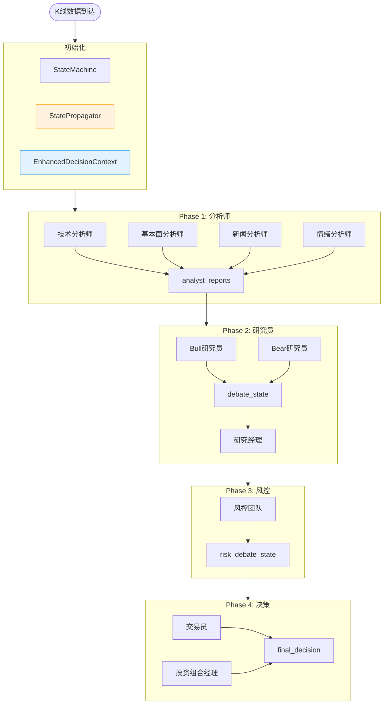

# Context Management 上下文管理系统

> 深入了解 Vibe Trading 的多 Agent 协作中，如何管理和传递上下文信息，确保关键决策数据不丢失。

## 目录

- [概述](#概述)
- [核心组件](#核心组件)
- [数据流动](#数据流动)
- [信息保护机制](#信息保护机制)
- [最佳实践](#最佳实践)

---

## 概述

在多 Agent 协作系统中，**Context Management** 是确保决策质量的关键。它负责：

1. **状态追踪** - 跟踪决策流程的每个阶段
2. **信息传递** - 在 Agent 之间传递关键数据
3. **知识保留** - 保存重要发现和推理链
4. **Token 优化** - 在不丢失关键信息的前提下压缩上下文

### 为什么需要 Context Management？

```
❌ 没有 Context Management:
Agent A → "技术指标显示上涨趋势"
   ↓ (纯文本，200字)
Agent B → 只看到 "上涨"
   ↓ (信息丢失)
Agent C → 不知道为什么上涨

✅ 有 Context Management:
Agent A → {
  "trend": "bullish",
  "indicators": {"RSI": 65, "MACD": "positive"},
  "confidence": 0.8,
  "key_factors": ["成交量放大", "突破阻力位"]
}
   ↓ (结构化传递)
Agent B → 完整接收所有数据
   ↓ (信息保留)
Agent C → 可以追溯推理过程
```

---

## 核心组件

### 1. DecisionStateMachine - 决策状态机

**位置**: `backend/src/vibe_trading/coordinator/state_machine.py`

**职责**: 管理决策流程的状态转换

```python
class DecisionStateMachine:
    """管理一次完整决策流程的状态转换"""

    # 状态定义
    PENDING = "pending"
    ANALYZING = "analyzing"          # Phase 1: 分析师
    DEBATING = "debating"            # Phase 2: 研究员
    ASSESSING_RISK = "assessing_risk" # Phase 3: 风控
    PLANNING = "planning"            # Phase 4: 决策层
    COMPLETED = "completed"

    def transition_to(self, new_state, reason=""):
        """状态转换，自动更新上下文"""
```

**特性**:
- ✅ 状态转换验证（防止非法跳转）
- ✅ 转换历史记录（可追溯）
- ✅ 钩子机制（进入/退出状态时触发）
- ✅ 自动更新 `DecisionContext`

---

### 2. EnhancedDecisionContext - 增强决策上下文

**位置**: `backend/src/vibe_trading/coordinator/state_propagator.py`

**职责**: 存储决策过程中的所有结构化数据

```python
@dataclass
class EnhancedDecisionContext:
    """增强的决策上下文"""

    # 基础信息
    decision_id: str
    symbol: str
    interval: str
    start_time: datetime

    # 分析师报告（结构化）
    analyst_reports: Dict[str, AgentReport]

    # 研究员辩论状态
    debate_state: DebateState  # bull/bear 历史、论点、裁决

    # 风控辩论状态
    risk_debate_state: RiskDebateState  # 三方风险评估

    # 市场数据
    market_data: Dict[str, Any]
    macro_state: Optional[Dict]

    # 技术指标、基本面、情绪
    technical_indicators: Dict[str, Any]
    fundamentals: Dict[str, Any]
    sentiment: Dict[str, Any]

    # 消息历史
    messages: List[AgentMessage]
```

**与纯文本的区别**:

| 特性 | 纯文本 | EnhancedDecisionContext |
|------|--------|-------------------------|
| 技术指标 | "RSI 是 65" | `{"RSI": 65, "signal": "neutral"}` |
| 置信度 | (可能丢失) | `0.85` (明确数值) |
| 关键发现 | 需要重新解析 | `key_findings: ["..."]` |
| 可追溯性 | ❌ | ✅ (timestamp, correlation_id) |

---

### 3. StatePropagator - 状态传播器

**位置**: `backend/src/vibe_trading/coordinator/state_propagator.py`

**职责**: 在 Agent 之间传播和更新状态

```python
class StatePropagator:
    """管理 Agent 之间的状态传播"""

    def create_initial_state(symbol, interval, market_data):
        """创建初始上下文"""

    def add_analyst_report(context, report):
        """添加分析师报告（结构化）"""

    def update_debate_state(context, speaker, content, round_number):
        """更新辩论状态"""

    def set_judgment(context, decision, confidence, reasoning):
        """设置研究经理裁决"""

    def build_execution_context(context):
        """构建执行层所需的完整上下文"""
```

**数据流示例**:

```python
# 1. 创建初始状态
context = propagator.create_initial_state(
    symbol="BTCUSDT",
    interval="30m",
    market_data={"price": 65000, "volume": 1000}
)

# 2. 添加分析师报告
report = AgentReport(
    agent_name="Technical Analyst",
    key_findings=["RSI超买", "MACD金叉"],
    confidence=0.8
)
context = propagator.add_analyst_report(context, report)

# 3. 更新辩论状态
context = propagator.update_debate_state(
    context, speaker="bull",
    content="基于技术指标，趋势看涨",
    round_number=1
)

# 4. 构建执行上下文
exec_context = propagator.build_execution_context(context)
# 包含所有阶段的信息，可供决策层使用
```

---

### 4. TokenOptimizer - Token 优化器

**位置**: `backend/src/vibe_trading/agents/token_optimizer.py`

**职责**: 优化 Token 使用，降低成本

```python
class TokenOptimizer:
    def compress_prompt(self, prompt, target_ratio=0.7):
        """压缩 Prompt (基于规则)"""

    def summarize_history(self, messages, max_messages=5):
        """总结历史对话"""
```

**优化策略**:
- 移除多余空白
- 压缩列表格式
- 移除重复结构
- 截断过长消息

**注意**: 当前实现是**基于规则的**，不是语义理解的压缩（未来改进方向）

---

### 5. MessageBroker - 消息代理

**位置**: `backend/src/vibe_trading/agents/messaging.py`

**职责**: Agent 之间的异步消息传递

```python
# 发送消息
message_broker.send(
    sender="technical_analyst",
    receiver="coordinator",
    message_type=MessageType.ANALYSIS_COMPLETE,
    content={"report": "..."},
    correlation_id=decision_id
)

# 接收消息
message = message_broker.receive("coordinator")
```

---

## 数据流动

### 完整决策流程的上下文传递



### 上下文转换示例

**Phase 1 → Phase 2** (压缩后传递):

```python
# Phase 1 输出 (结构化)
analyst_reports = {
    "technical": {
        "trend": "bullish",
        "rsi": 65,
        "macd": "positive",
        "key_findings": ["突破阻力位", "成交量放大"]
    },
    "fundamental": {
        "funding_rate": 0.01,
        "open_interest": "increasing"
    }
}

# 传递给 Phase 2 (压缩为文本)
compressed_context = """
Symbol: BTCUSDT
Price: 65000

TECHNICAL Report:
趋势看涨，RSI 65，MACD 正向。关键发现：突破阻力位、成交量放大

FUNDAMENTAL Report:
资金费率 0.01，持仓量增加
""".strip()  # 经过 compress_prompt() 处理
```

---

## 信息保护机制

### 当前已实现的保护

#### 1. 结构化数据存储

```python
# AgentReport 保留完整信息
@dataclass
class AgentReport:
    agent_name: str
    content: str              # 完整文本
    key_findings: List[str]   # 关键发现
    confidence: float         # 置信度
    raw_data: Dict            # 原始数据
```

#### 2. 消息历史追踪

```python
# 所有 Agent 消息都被记录
context.messages = [
    AgentMessage(
        agent_name="Bull Researcher",
        content="基于技术指标...",
        timestamp=datetime.now(),
        correlation_id=decision_id,
        metadata={"round": 1}
    ),
    # ...
]
```

#### 3. 状态快照导出

```python
# 可随时导出完整状态用于调试
snapshot = propagator.export_state_snapshot(context)
# 包含所有报告、辩论状态、市场数据等
```

#### 4. Token 压缩前备份

```python
# 原始完整上下文被保留在 EnhancedDecisionContext
compressed = token_optimizer.compress_prompt(full_context)
# full_context 仍然在 context.analyst_reports 中可用
```

### 潜在的信息丢失点

#### ⚠️ Token 压缩的盲目性

**问题**: `compress_prompt()` 使用规则压缩，可能删除关键信息

**示例**:
```python
# 原始: 技术指标列表
1. RSI: 65 (超买)
2. MACD: 金叉 (看涨)
3. 成交量: 放大 2 倍
4. 阻力位: 突破 $65,000
5. 支撑位: $63,500
6. ⚠️ 风险: 波动率过高

# 压缩后 (只保留前5项)
• RSI: 65, MACD: 金叉, 成交量: 放大 2 倍, 阻力位: 突破, 支撑位: $63,500
  ... and 1 more items  # ⚠️ 风险警告丢失！
```

**解决方案** (未来):
- 使用 LLM 进行语义摘要
- 优先级评分系统
- 关键信息标记保护

#### ⚠️ Agent 内部推理链断层

**问题**: 每个 Agent 的 `pi_agent_core` 消息历史对其他 Agent 不可见

**示例**:
```python
# Technical Analyst 的内部推理
agent.state.messages = [
    UserMessage("分析 BTCUSDT"),
    AssistantMessage("让我先检查 RSI..."),
    AssistantMessage("RSI 显示超买，但..."),
    AssistantMessage("等等，成交量放大验证了突破"),
    AssistantMessage("结论：看涨")
]

# 传递给 Researcher 的只有最后的结论
report = "结论：看涨"  # ❌ 推理过程丢失
```

#### ⚠️ 多阶段累积信息衰减

**问题**: Phase 1 → Phase 2 → Phase 3 → Phase 4，信息逐级衰减

```
Phase 1: 100% 信息
   ↓ (压缩 80%)
Phase 2: 80% 信息
   ↓ (再压缩)
Phase 3: 60% 信息
   ↓ (再压缩)
Phase 4: 40% 信息  # ❌ 关键细节可能丢失
```

---

## 最佳实践

### ✅ DO - 推荐做法

#### 1. 使用结构化报告

```python
# ✅ 好的做法
report = AgentReport(
    agent_name="Technical Analyst",
    content="完整分析报告...",
    key_findings=["突破阻力位", "成交量验证"],
    confidence=0.85,
    raw_data={"RSI": 65, "MACD": 0.5}
)
propagator.add_analyst_report(context, report)

# ❌ 不好的做法
report = "技术分析师说看涨"  # 丢失所有细节
```

#### 2. 保留原始数据引用

```python
# ✅ 在 AgentReport 中包含 raw_data
report.raw_data = {
    "indicators": {"RSI": 65, "MACD": 0.5},
    "klines": [...],  # 完整 K线数据
    "timestamp": datetime.now()
}

# 后续 Agent 可以访问原始数据
if context.analyst_reports["technical"].raw_data:
    rsi = context.analyst_reports["technical"].raw_data["indicators"]["RSI"]
```

#### 3. 使用 correlation_id 追踪

```python
# ✅ 所有相关消息使用同一个 correlation_id
decision_id = f"{symbol}_{interval}_{timestamp}"

# 在各个阶段使用
message_broker.send(
    sender="analyst",
    content=...,
    correlation_id=decision_id  # 追踪整个决策流程
)
```

#### 4. 定期导出状态快照

```python
# ✅ 调试和分析时使用
snapshot = propagator.export_state_snapshot(context)
logger.info(f"Decision snapshot: {snapshot}")

# 可用于:
# - 调试信息丢失
# - 分析决策过程
# - 回溯推理链
```

### ❌ DON'T - 避免的做法

#### 1. 不要过度依赖 Token 压缩

```python
# ❌ 避免多次压缩
compressed1 = optimizer.compress_prompt(text, 0.8)
compressed2 = optimizer.compress_prompt(compressed1, 0.8)
compressed3 = optimizer.compress_prompt(compressed2, 0.8)
# 信息会严重失真

# ✅ 建议:
# - 只在必要时压缩
# - 保留原始完整上下文在 EnhancedDecisionContext
# - 压缩只用于传递，不用于存储
```

#### 2. 不要破坏数据结构

```python
# ❌ 避免将结构化数据转为纯文本
for report in analyst_reports.values():
    context_str += f"{report}\n"  # 丢失所有结构

# ✅ 建议:
# - 保持结构化传递
# - 只在最后生成文本摘要时才转换
```

#### 3. 不要忽略 Agent 的内部推理

```python
# ❌ 只传递最终结论
await agent.prompt("分析市场")
conclusion = agent.state.messages[-1].content  # 只有最后一句

# ✅ 建议:
# - 订阅 agent 事件，记录推理过程
# - 将关键推理步骤保存到 AgentReport.metadata
```

---

## 未来改进方向

### 1. 智能 Context 压缩

**目标**: 基于语义理解的关键信息保留

```python
class SemanticContextCompressor:
    def compress(self, context: EnhancedDecisionContext) -> str:
        # 1. 提取关键事实
        key_facts = self.extract_key_facts(context)
        
        # 2. 评估信息重要性
        scored_facts = self.score_importance(key_facts)
        
        # 3. 优先保留高重要性信息
        preserved = self.preserve_important(scored_facts)
        
        # 4. 压缩低重要性信息
        compressed = self.compress_less_important(preserved)
        
        return compressed
```

### 2. 推理链可视化

**目标**: 让 Agent 能够追溯完整的推理过程

```python
@dataclass
class ReasoningStep:
    agent_name: str
    step_number: int
    premise: str        # 前提
    reasoning: str      # 推理过程
    conclusion: str     # 结论
    confidence: float
    evidence: List[str] # 支持证据

# 可以构建完整的推理链
reasoning_chain = [
    ReasoningStep(
        agent_name="Technical Analyst",
        premise="RSI > 70 且 MACD 金叉",
        reasoning="超买但有金叉，说明强势上涨",
        conclusion="短期看涨",
        confidence=0.8,
        evidence=["RSI=75", "MACD=0.5"]
    ),
    # ...
]
```

### 3. Context 版本控制

**目标**: 跟踪上下文的演变历史

```python
class ContextVersion:
    version: int
    timestamp: datetime
    changes: List[str]
    author: str  # 哪个 Agent 修改的
    diff: str    # 与上一版本的差异

# 可以追溯:
# "Phase 2 的结论是基于 Phase 1 的哪个版本？"
```

---

## 总结

| 组件 | 作用 | 优势 | 局限 |
|------|------|------|------|
| **DecisionStateMachine** | 状态管理 | 结构化、可追溯 | 只存储阶段级摘要 |
| **EnhancedDecisionContext** | 数据容器 | 结构化、完整 | 内存占用较大 |
| **StatePropagator** | 状态传播 | 自动化管理 | 依赖手动调用 |
| **TokenOptimizer** | 成本优化 | 降低 API 成本 | 基于规则，可能丢失信息 |
| **MessageBroker** | 消息传递 | 异步解耦 | 不保证消息可靠性 |

**关键洞察**:
- ✅ 你的系统已经有相当完善的 Context Management 基础
- ⚠️ 主要风险在于 Token 压缩和多阶段信息衰减
- 🔮 未来改进方向：语义理解压缩、推理链追踪、版本控制

**建议优先级**:
1. **P0**: 增强 AgentReport 的结构化（已经在代码中定义，需要确保使用）
2. **P1**: 实现 Key Facts 提取机制（保护关键信息不被压缩）
3. **P2**: 优化 TokenOptimizer（引入语义评分）
4. **P3**: 构建推理链可视化（调试和分析）
