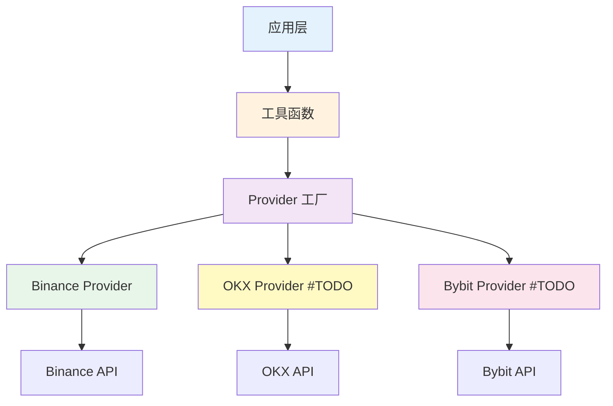

# 数据提供者 API

本文档介绍 Vibe Trading 的标准化交易所数据提供者（Provider）API，这是一个内部Python API，用于统一访问不同交易所的数据。

## 概述

### 设计目标

- **统一接口**：所有交易所通过相同的接口访问
- **可扩展性**：轻松添加新的交易所支持
- **向后兼容**：保留现有工具函数，无缝迁移
- **类型安全**：使用标准化的数据模型

### 架构



## 核心 API

### 1. ProviderFactory

工厂类，用于创建和管理交易所数据提供者实例。

#### 导入

```python
from vibe_trading.data_sources.providers.factory import ProviderFactory
```

#### 方法

##### `get_provider(exchange: str) -> ExchangeProvider`

获取或创建交易所Provider实例（单例模式）。

**参数**：

- `exchange` (str): 交易所名称（如 "binance"）

**返回**：

- `ExchangeProvider`: Provider实例

**示例**：

```python
# 获取 Binance Provider
provider = await ProviderFactory.get_provider("binance")

# 使用Provider
price = await provider.get_current_price("BTCUSDT")

# 清理资源（可选，程序退出时自动清理）
await ProviderFactory.close_provider("binance")
```

##### `create_provider(exchange: str, config: ExchangeConfig) -> ExchangeProvider`

使用自定义配置创建Provider实例。

**参数**：

- `exchange` (str): 交易所名称
- `config` (ExchangeConfig): 交易所配置对象

**返回**：

- `ExchangeProvider`: Provider实例

##### `close_all()`

关闭所有Provider实例并释放资源。

```python
await ProviderFactory.close_all()
```

##### `list_active_providers() -> list`

列出所有活跃的Provider。

```python
active = ProviderFactory.list_active_providers()
print(f"活跃的Provider: {active}")
```

### 2. ExchangeProvider

所有交易所Provider必须实现的抽象接口。

#### 核心方法

##### `async connect() -> None`

建立与交易所的连接。

##### `async disconnect() -> None`

断开所有连接并释放资源。

##### `async get_klines(symbol: str, interval: str, limit: int = 100, start_time: Optional[int] = None, end_time: Optional[int] = None) -> List[StandardKline]`

获取K线数据。

**参数**：

- `symbol` (str): 交易对符号
- `interval` (str): K线间隔（如 "1m", "5m", "1h"）
- `limit` (int): 获取数量（默认100）
- `start_time` (int, 可选): 开始时间（毫秒时间戳）
- `end_time` (int, 可选): 结束时间（毫秒时间戳）

**返回**：

- `List[StandardKline]`: 标准化K线数据列表

**示例**：

```python
klines = await provider.get_klines("BTCUSDT", "5m", 50)
for kline in klines:
    print(f"时间: {kline.open_datetime}, 收盘: {kline.close}")
```

##### `async get_ticker(symbol: str) -> StandardTicker`

获取24小时行情数据。

##### `async get_orderbook(symbol: str, limit: int = 20) -> StandardOrderBook`

获取订单簿数据。

##### `async get_current_price(symbol: str) -> float`

获取当前价格。

##### `async subscribe_klines(symbol: str, interval: str, callback: Callable) -> None`

订阅K线数据更新。

##### `async unsubscribe_klines(symbol: str, interval: str) -> None`

取消订阅K线数据。

### 3. 数据模型

#### StandardKline

标准化的K线数据模型。

```python
@dataclass
class StandardKline:
    exchange: str           # 交易所标识
    symbol: str             # 交易对
    interval: str           # K线间隔
    open_time: int          # 开盘时间（毫秒）
    open: float             # 开盘价
    high: float             # 最高价
    low: float              # 最低价
    close: float            # 收盘价
    volume: float           # 成交量
    close_time: int         # 收盘时间（毫秒）
    quote_volume: float     # 成交额
    trades: int             # 成交笔数
    taker_buy_base: float   # 主动买入量
    taker_buy_quote: float  # 主动买入额
    is_final: bool          # 是否已完成
```

#### StandardTicker

标准化的24小时行情数据。

#### StandardOrderBook

标准化的订单簿数据。

## 使用示例

### 基础使用

```python
import asyncio
from vibe_trading.data_sources.providers.factory import ProviderFactory

async def main():
    # 创建Provider
    provider = await ProviderFactory.get_provider("binance")
  
    # 获取价格
    price = await provider.get_current_price("BTCUSDT")
    print(f"BTC价格: ${price}")
  
    # 获取K线
    klines = await provider.get_klines("BTCUSDT", "5m", 10)
    for k in klines:
        print(f"OHLCV: {kline.open}, {kline.high}, {kline.low}, {kline.close}, {kline.volume}")
  
    # 清理
    await ProviderFactory.close_all()

asyncio.run(main())
```

### 订阅K线数据

```python
async def on_kline_update(kline: StandardKline):
    """K线数据回调"""
    print(f"新K线: {kline.symbol} @ {kline.close}")

async def main():
    provider = await ProviderFactory.get_provider("binance")
  
    # 订阅K线
    await provider.subscribe_klines("BTCUSDT", "5m", on_kline_update)
  
    # 保持连接以接收更新
    await asyncio.sleep(3600)  # 运行1小时
  
    # 取消订阅
    await provider.unsubscribe_klines("BTCUSDT", "5m")
    await ProviderFactory.close_all()

asyncio.run(main())
```

### 健康检查

```python
provider = await ProviderFactory.get_provider("binance")

# 执行健康检查
is_healthy = await provider.health_check()

print(f"连接状态: {provider.status}")
print(f"是否健康: {'是' if is_healthy else '否'}")
```

## 数据模型转换

### 转换为字典

```python
kline = await provider.get_klines("BTCUSDT", "5m", 1)
k = klines[0]

# 转换为字典
data = k.to_dict()
print(data)
# 输出: {
#   'exchange': 'binance',
#   'symbol': 'BTCUSDT',
#   'open_time': 1234567890000,
#   'open': 50000.0,
#   ...
# }
```

### 转换为传统格式

```python
from vibe_trading.tools.market_data_tools import convert_standard_to_legacy

std_kline = await provider.get_klines("BTCUSDT", "5m", 1)[0]

# 转换为传统Kline格式
legacy_kline = convert_standard_to_legacy(std_kline)
print(legacy_kline)
```

## 向后兼容

### 现有工具函数仍然可用

```python
# 这些函数现在内部使用Provider，但接口保持不变
from vibe_trading.tools.market_data_tools import (
    get_current_price,
    get_kline_data,
    get_24hr_ticker,
    get_order_book
)

# 使用方式完全相同
result = await get_current_price("BTCUSDT")
print(result['price'])
```

### Agent工具兼容

所有Agent工具无需修改即可使用新的Provider接口：

```python
from vibe_trading.agents.agent_tools import execute_get_current_price, GetCurrentPriceParams

# Agent工具自动使用Provider
args = GetCurrentPriceParams(symbol="BTCUSDT")
result = await execute_get_current_price("get_current_price", args)
print(result)
```

## 高级用法

### 多交易所对比

```python
async def compare_exchanges():
    """对比不同交易所的价格"""
    exchanges = ["binance"]  # 未来可添加 "okx", "bybit"
  
    for exchange in exchanges:
        provider = await ProviderFactory.get_provider(exchange)
        try:
            price = await provider.get_current_price("BTCUSDT")
            print(f"{exchange}: ${price}")
        except Exception as e:
            print(f"{exchange}: 错误 - {e}")
```

### 自定义配置

```python
from vibe_trading.data_sources.exchange_config import BinanceExchangeConfig

# 创建自定义配置
config = BinanceExchangeConfig(
    exchange_type="binance",
    environment="mainnet",
    api_key="your_key",
    api_secret="your_secret",
    enable_websocket=True,
    enable_rest=True,
)

# 使用自定义配置
provider = await ProviderFactory.create_provider("binance", config)
```

### 错误处理

```python
from vibe_trading.data_sources.providers.registry import ProviderRegistry

async def safe_get_price(exchange: str, symbol: str):
    """安全获取价格"""
    # 检查交易所是否支持
    if not ProviderRegistry.is_registered(exchange):
        raise ValueError(f"不支持的交易所: {exchange}")
  
    provider = await ProviderFactory.get_provider(exchange)
  
    try:
        price = await provider.get_current_price(symbol)
        return price
    except Exception as e:
        print(f"获取价格失败: {e}")
        return None
    finally:
        await ProviderFactory.close_provider(exchange)
```

## 性能优化

### 连接复用

Provider实例会自动缓存，重复获取同一交易所的Provider会返回同一实例，提高性能。

```python
# 第一次调用：创建实例
provider1 = await ProviderFactory.get_provider("binance")

# 第二次调用：返回同一实例
provider2 = await ProviderFactory.get_provider("binance")

assert provider1 is provider2  # True - 同一实例
```

### 批量操作

```python
# 并行获取多个交易对的价格
import asyncio

async def get_multiple_prices(symbols: list[str]):
    provider = await ProviderFactory.get_provider("binance")
  
    tasks = [
        provider.get_current_price(symbol)
        for symbol in symbols
    ]
  
    prices = await asyncio.gather(*tasks)
    return dict(zip(symbols, prices))

prices = await get_multiple_prices(["BTCUSDT", "ETHUSDT", "SOLUSDT"])
print(prices)
```

## 下一步

- 查看 [配置说明](/guide/configuration) 了解多交易所配置
- 学习 [自定义Agent](/guide/custom-agent) 添加新功能
