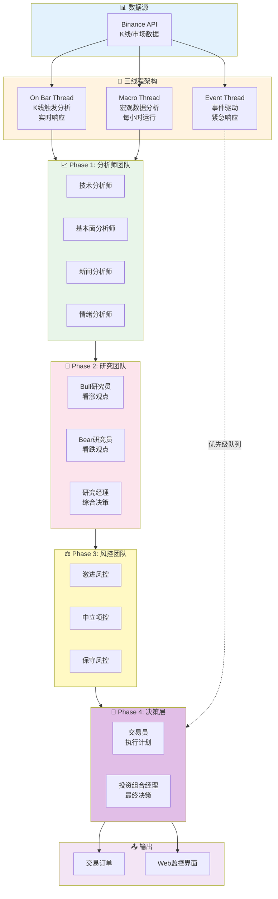

# 快速开始指南

欢迎使用 Vibe Trading，这是一个 AI 驱动的多Agent协作量化交易系统。本指南将帮助你在几分钟内启动并运行系统，使你能够利用多Agent协作、智能辩论和风控评估构建专业的量化交易策略。

## 系统架构



::: tip 提示
Vibe Trading 支持两种运行模式：Paper Trading（模拟交易）和 Live Trading（实盘交易）。建议新手先使用 Paper Trading 模式熟悉系统。
:::

## 环境要求

- Python 3.13+
- Node.js 18+ (用于Web界面开发)
- Git

## 快速安装

### 步骤一：获取项目代码

```bash
# 克隆最新版本
git clone https://github.com/encyc/vibe-trading.git
cd vibe-trading
```

| 分支 | 适用场景 |
|------|----------|
| main | 开发版本，包含最新特性 |
| v*.*.* | 稳定版本，推荐生产使用 |

### 步骤二：安装后端依赖

我们使用 `uv` 作为包管理器，它比传统的 pip 更快。

```bash
cd backend
uv pip install -e .
```

如果没有安装 `uv`，可以先安装：

```bash
# macOS/Linux
curl -LsSf https://astral.sh/uv/install.sh | sh

# Windows
powershell -c "irm https://astral.sh/uv/install.ps1 | iex"
```

### 步骤三：配置环境变量

复制示例配置文件：

```bash
cp .env.example .env
```

编辑项目根目录的 `.env` 文件，配置以下内容：

```env
# 交易模式与周期
TRADING_MODE=paper
SYMBOLS=BTCUSDT,ETHUSDT
INTERVAL=30m

# Binance API 配置：Paper Trading 默认使用测试网
BINANCE_TESTNET_API_KEY=your_testnet_api_key_here
BINANCE_TESTNET_API_SECRET=your_testnet_api_secret_here

# Live Trading 才需要主网 key
BINANCE_API_KEY=your_mainnet_api_key_here
BINANCE_API_SECRET=your_mainnet_api_secret_here

# LLM 配置：名称对应 backend/src/pi_ai/llm.yaml
LLM_MODEL=glm_4_7
OPENAI_API_KEY=your_openai_api_key_here

# 数据库配置
DATABASE_URL=sqlite+aiosqlite:///./vibe_trading.db

# 日志配置
LOG_LEVEL=INFO
```

::: tip API Key 获取
- **Binance API**：访问 [Binance API 管理](https://www.binance.com/en/my/settings/api-management) 创建API密钥
- **OpenAI API**：访问 [platform.openai.com](https://platform.openai.com/api-keys) 获取API密钥
:::

### 步骤四：安装前端依赖

```bash
cd ../frontend/react-app
npm install
cd ../..
```

## 运行系统

### Paper Trading 模式（推荐新手）

```bash
# 返回项目根目录
cd ..

# 启动 Paper Trading
make start SYMBOL=BTCUSDT INTERVAL=5m
```

### 实盘交易模式

::: warning 警告
实盘交易模式会使用真实资金，请谨慎使用！建议先在 Paper Trading 模式下充分测试。
:::

```bash
# 仅打印订单，不执行
PYTHONPATH=backend/src uv run -- vibe-trade start BTCUSDT --interval 5m --mode live

# 真实执行交易
PYTHONPATH=backend/src uv run -- vibe-trade start BTCUSDT --interval 5m --mode live --execute
```

## 启动 Web 监控界面

推荐使用两个终端分别启动后端交易系统和 React 前端：

```bash
# 终端 1：启动交易系统 + WebSocket 后端
make start-web SYMBOL=BTCUSDT INTERVAL=5m

# 终端 2：启动 React 前端
make web
```

然后在浏览器中访问 `http://localhost:3000` 查看实时监控界面。后端 API 和 WebSocket 默认运行在 `http://localhost:8000`。

### 使用 Prime Agent 模式

Prime Agent 模式是推荐的生产模式，它包含更完善的三线程架构和监控：

```bash
PYTHONPATH=backend/src uv run -- vibe-trade prime BTCUSDT --interval 5m
```

## 故障排除

### 查看服务状态

```bash
# 查看系统日志
tail -f logs/vibe_trading.log

# 查看特定模块日志
grep "TechnicalAnalyst" logs/vibe_trading.log
```

### 常见问题

<details>
<summary><strong>依赖安装失败</strong></summary>

如果网络原因导致依赖安装失败，可以尝试：

```bash
# 配置国内镜像源
export UV_INDEX_URL=https://pypi.tuna.tsinghua.edu.cn/simple
uv pip install -e .
```

</details>

<details>
<summary><strong>数据库文件异常</strong></summary>

当前 SQLite 表会在系统启动时自动初始化。如果本地测试库损坏，可以先停止服务，再删除旧库让系统重建：

```bash
rm vibe_trading.db
make start SYMBOL=BTCUSDT INTERVAL=30m
```
</details>

<details>
<summary><strong>LLM API 调用失败</strong></summary>

检查 `.env` 文件中的 API Key 配置是否正确，或切换到 `backend/src/pi_ai/llm.yaml` 中已有的模型配置：

```env
# 选择 llm.yaml 中存在的配置
LLM_MODEL=glm_4_7

# 按该模型配置需要设置对应 API Key
OPENAI_API_KEY=your_openai_key
ANTHROPIC_API_KEY=your_anthropic_key
GOOGLE_API_KEY=your_google_key
```
</details>

::: tip 日志调试
系统支持详细的日志输出，可以通过 `.env` 文件中的 `LOG_LEVEL` 调整：
- `DEBUG`：详细的调试信息
- `INFO`：正常运行信息（默认）
- `WARNING`：警告和错误信息
:::

## 下一步

- 了解 [项目简介](/guide/intro)：了解整体定位、技术栈与核心能力
- 查看 [Agent团队](/guide/agents)：了解12个专业Agent的职责和功能
- 阅读 [系统架构](/guide/architecture)：深入了解三线程架构与Agent协作流程
- 配置 [Web监控](/guide/monitoring)：使用 Agent Arena 界面查看实时决策和历史K线追溯
