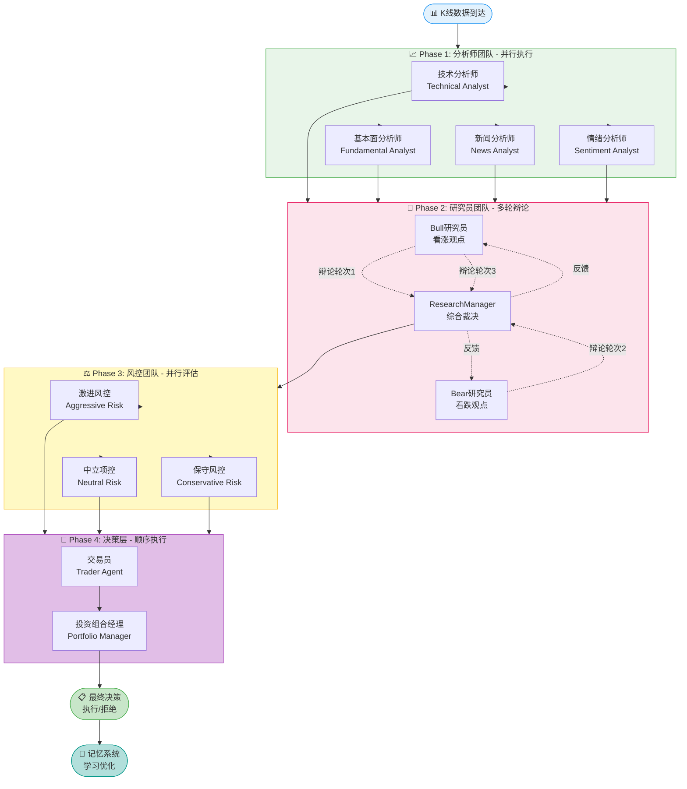

# 协作流程

本文档详细介绍 Vibe Trading 系统中 Agent 的协作流程和工作机制。

## 4阶段协作流程



## 详细流程说明

### Phase 1: 分析师团队

**触发条件**：新K线数据到达

**执行方式**：并行执行（4个分析师同时工作）

**工作流程**：

1. **数据准备**
   ```python
   # 获取最新K线数据
   klines = await storage.get_latest_klines(symbol, count=100)
   
   # 计算技术指标
   indicators = await calculate_indicators(klines)
   
   # 获取市场数据
   market_data = await get_market_data(symbol)
   ```

2. **并行执行**
   ```python
   # 并行执行4个分析师
   results = await asyncio.gather(
       technical_analyst.analyze(klines, indicators),
       fundamental_analyst.analyze(market_data),
       news_analyst.analyze(symbol),
       sentiment_analyst.analyze(symbol)
   )
   ```

3. **结果整合**
   ```python
   analyst_reports = {
       "technical": results[0],
       "fundamental": results[1],
       "news": results[2],
       "sentiment": results[3]
   }
   ```

**输出**：4份分析报告，包含：
- 趋势方向
- 关键信号
- 支撑阻力位
- 市场情绪
- 置信度评分

---

### Phase 2: 研究员团队

**触发条件**：分析师团队完成

**执行方式**：多轮辩论（通常3-5轮）

**工作流程**：

1. **初始化辩论**
   ```python
   debate = Debate(
       topic=f"投资 {symbol} 的可行性",
       bull_researcher=BullResearcherAgent(),
       bear_researcher=BearResearcherAgent(),
       research_manager=ResearchManagerAgent()
   )
   ```

2. **辩论轮次**
   ```python
   # 第1轮：看涨研究员开场
   bull_args = await debate.bull_researcher.present_case(analyst_reports)
   
   # 第2轮：看跌研究员反驳
   bear_args = await debate.bear_researcher.rebut(bull_args, analyst_reports)
   
   # 第3轮：看涨研究员回应
   bull_rebuttal = await debate.bull_researcher.respond(bear_args)
   
   # 更多轮次...
   ```

3. **论点提取**
   ```python
   # 使用 ArgumentExtractor 提取论点
   bull_arguments = extract_arguments(bull_args)
   bear_arguments = extract_arguments(bear_args)
   ```

4. **综合裁决**
   ```python
   # 研究经理综合评估
   recommendation = await debate.research_manager.make_decision(
       bull_arguments=bull_arguments,
       bear_arguments=bear_arguments,
       analyst_reports=analyst_reports
   )
   ```

**输出**：投资建议
```json
{
  "direction": "LONG",
  "confidence": 0.75,
  "rationale": "技术面和基本面支持上涨，但需注意回调风险",
  "key_factors": [
    {"factor": "技术突破", "weight": 0.3},
    {"factor": "资金流入", "weight": 0.25},
    {"factor": "情绪积极", "weight": 0.2}
  ]
}
```

---

### Phase 3: 风控团队

**触发条件**：研究经理完成投资建议

**执行方式**：并行执行（3个风控分析师同时工作）

**工作流程**：

1. **风险评估**
   ```python
   # 并行执行3个风控分析师
   risk_assessments = await asyncio.gather(
       aggressive_risk_analyst.assess(recommendation, market_data),
       neutral_risk_analyst.assess(recommendation, market_data),
       conservative_risk_analyst.assess(recommendation, market_data)
   )
   ```

2. **风险计算**
   ```python
   # VaR计算
   var_value = calculate_var(position_size, confidence_level)
   
   # 凯利公式
   kelly_ratio = calculate_kelly(win_rate, avg_win, avg_loss)
   
   # 波动率调整
   adjusted_size = adjust_for_volatility(position_size, volatility)
   ```

3. **风险评估输出**
   ```json
   {
     "aggressive": {
       "position_size": "30%",
       "stop_loss": "3%",
       "take_profit": "10%",
       "risk_reward_ratio": 3.33
     },
     "neutral": {
       "position_size": "20%",
       "stop_loss": "2%",
       "take_profit": "8%",
       "risk_reward_ratio": 4.0
     },
     "conservative": {
       "position_size": "10%",
       "stop_loss": "1.5%",
       "take_profit": "5%",
       "risk_reward_ratio": 3.33
     }
   }
   ```

---

### Phase 4: 决策层

**触发条件**：风控团队完成

**执行方式**：顺序执行（交易员 → 投资组合经理）

**工作流程**：

1. **交易员制定计划**
   ```python
   # 交易员综合风控建议
   trading_plan = await trader_agent.create_plan(
       direction=recommendation.direction,
       risk_assessments=risk_assessments,
       current_price=current_price,
       account_balance=account_balance
   )
   ```

2. **投资组合经理审批**
   ```python
   # 投资组合经理最终决策
   final_decision = await portfolio_manager.approve(
       trading_plan=trading_plan,
       recommendation=recommendation,
       risk_assessments=risk_assessments,
       historical_performance=performance_history
   )
   ```

3. **决策输出**
   ```json
   {
     "decision": "BUY",
     "quantity": 0.2,
     "entry_price": 65000,
     "stop_loss": 63500,
     "take_profit": 68500,
     "rationale": "综合评估后，建议买入，置信度75%",
     "confidence": 0.75
   }
   ```

## 异常处理

### 阶段失败处理

如果某个阶段失败，系统会：

1. **记录错误**
   ```python
   logger.error(f"Phase {phase} failed: {error}")
   ```

2. **触发应急流程**
   ```python
   await emergency_handler.handle_failure(phase, error)
   ```

3. **降级策略**
   - 如果分析师失败，使用默认值
   - 如果辩论失败，跳过辩论阶段
   - 如果风控失败，使用最保守策略

### 超时处理

每个阶段都有超时限制：

```python
async def run_with_timeout(agent_method, timeout_seconds):
    try:
        result = await asyncio.wait_for(
            agent_method(),
            timeout=timeout_seconds
        )
        return result
    except asyncio.TimeoutError:
        logger.warning(f"Agent method timeout: {agent_method.__name__}")
        return get_default_result()
```

## 性能优化

### 1. 并行执行

所有可以并行的任务都使用 `asyncio.gather`：

```python
# 分析师并行
results = await asyncio.gather(
    technical_analyst.analyze(),
    fundamental_analyst.analyze(),
    news_analyst.analyze(),
    sentiment_analyst.analyze()
)

# 风控并行
risk_assessments = await asyncio.gather(
    aggressive_risk.assess(),
    neutral_risk.assess(),
    conservative_risk.assess()
)
```

### 2. 缓存机制

缓存常用数据：

```python
@lru_cache(maxsize=100)
async def get_cached_data(key):
    return await fetch_data(key)
```

### 3. 资源池

使用连接池管理资源：

```python
connection_pool = ConnectionPool(max_size=10)

async with connection_pool.acquire() as conn:
    result = await conn.query(sql)
```

## 监控和日志

### 阶段监控

每个阶段都有详细的监控：

```python
class PhaseMonitor:
    def __init__(self, phase_name):
        self.phase_name = phase_name
        self.start_time = None
        self.end_time = None
    
    async def __aenter__(self):
        self.start_time = time.time()
        logger.info(f"Phase {self.phase_name} started")
        return self
    
    async def __aexit__(self, exc_type, exc_val, exc_tb):
        self.end_time = time.time()
        duration = self.end_time - self.start_time
        logger.info(f"Phase {self.phase_name} completed in {duration:.2f}s")
```

### 决策追踪

记录每个决策的完整过程：

```python
class DecisionTracker:
    def track_decision(self, decision_data):
        # 记录到数据库
        self.db.decisions.insert(decision_data)
        
        # 发送到Web界面
        await websocket.send_decision(decision_data)
        
        # 存储到记忆系统
        self.memory.store(decision_data)
```

## 下一步

- 配置 [Web监控](/guide/monitoring) 查看实时流程
- 了解 [回测系统](/guide/backtest) 验证策略
- 学习 [记忆系统](/guide/memory) 优化决策